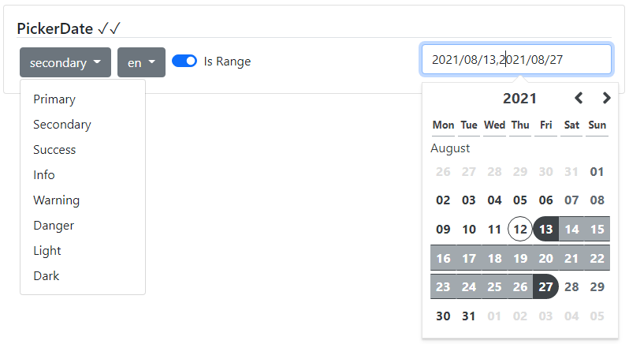

### Readme

> [](../../readme.md)
> [](usage.md)

### PickerDate

[](https://krsln.github.io/Showcase/Beta/PickerDate)

#### Dependencies

@import "~@qrsln/lootstrap/scss/lootstrap";  
import {Guid} from '@qrsln/utils/Core';
import {Overlay} from '@qrsln/utils/Animations';

```shell
npm install --save @qrsln/utils
npm install --save @qrsln/lootstrap
```

#### Properties

| Name              | Description                                                      |
|-------------------|------------------------------------------------------------------|
| [Color]:string    | "primary" "secondary" "success" "info" "warning" "danger" "dark" |
| [Locale]:string   | default is 'en'                                                  |
| [IsRange]:boolean | default is false                                                 |

#### Screenshots

  
