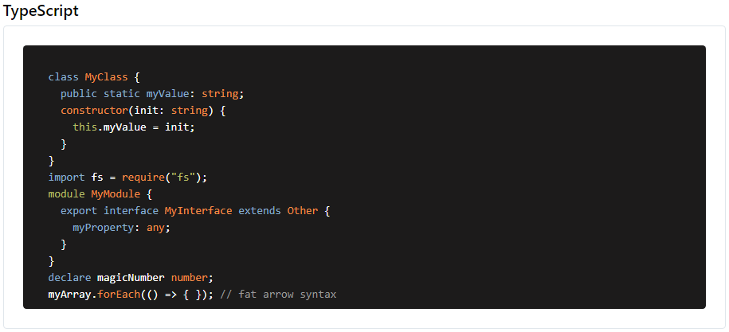
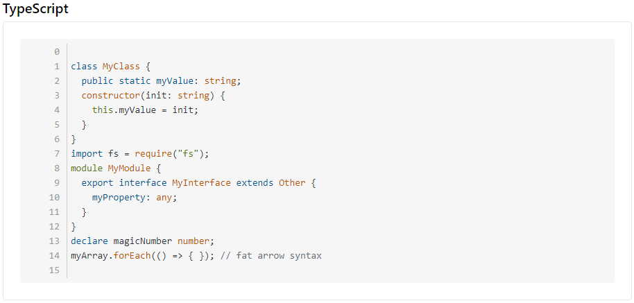

## Highlighter

[](https://www.patreon.com/qrsln)
[](https://npmcharts.com/compare/@qrsln/highlighter?minimal=true)
[](https://badge.fury.io/js/%40qrsln%2Fhighlighter)

Supported Languages: typescript, html, css/scss/less, csharp, javascript, json, php, python, markdown

> For Angular

[](https://krsln.github.io/Showcase/Libraries/Highlighter)
[](../projects.md)
[](usage.md)

#### Dependencies

```shell
 npm install highlight.js 
```

#### Properties

| Params        | desc                                                            |
|---------------|-----------------------------------------------------------------|
| [theme]       | _highlight.js theme_ [default: 'stackoverflow-dark']            |
| [code]        | code here or innerHTML [if code not set it will look innerHTML] |
| [lineNumbers] | Line Numbers [default: false]                                   |
| [lang]        | code language here [necessary] Default value: `html`            |
| [options]     | _highlight.js options_                                          |

### Screenshots
  
  
