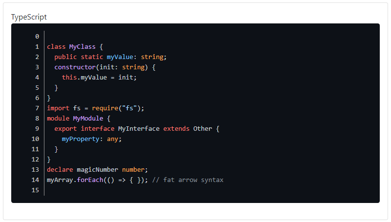

### Readme

> [](../readme.desc.md)
> [](usage.md)

### Highlighter

Supported Languages: typescript, html, css/scss/less, csharp, javascript, json, php, python, markdown

[](https://krsln.github.io/NgLootBox/Libraries/Highlighter)
[](../projects.md)

#### Dependencies

```
 npm install highlight.js 
```

#### Properties

Name | Description
 --- | ---  
[theme] | _highlight.js theme_ classes [default: 'default']
[code] | code here or innerHTML [if code not set it will look innerHTML]
[lineNumbers] | Line Numbers [default: false]
[lang] | code language here [necessary] Default value: `html`
[options] | _highlight.js options_

### Screenshots
Highlighter Github  
  
Highlighter Github-Dark  
  
