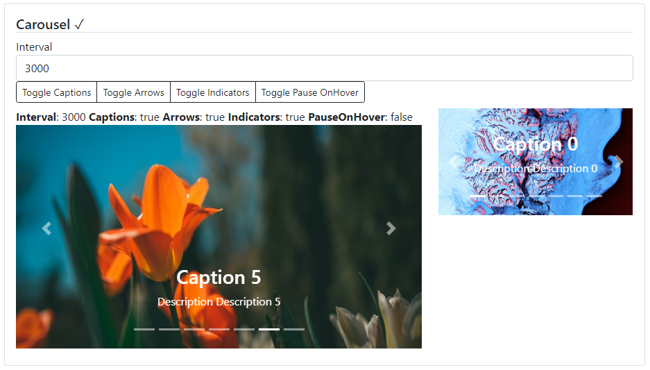

### Readme

> [](../../readme.md)
> [](usage.md)

### Carousel

[](https://krsln.github.io/NgLootBox/Beta/Carousel)

#### Dependencies

@import "~@qrsln/lootstrap/scss/lootstrap";  
import {Guid} from '@qrsln/utils/Core';

```shell
npm install --save @qrsln/utils
npm install --save @qrsln/lootstrap
```

#### Properties

Name | Description
 --- | ---  
images: CarouselItem[] | items
interval:number | Time in `milliseconds` before the next slide is shown. Default value: `5000`
showNavigationArrows:boolean | If true, `previous` and `next` navigation arrows will be visible on the slide. Default value: `true`
showNavigationIndicators:boolean | If `true`, navigation indicators at the bottom of the slide will be visible. Default value: `true`
showCaptions:boolean | If `true`, captions will be visible. Default value: true
pauseOnHover:boolean | If `true`, will pause slide switching when mouse cursor hovers the slide. Default value: `false`

#### Screenshots


 
