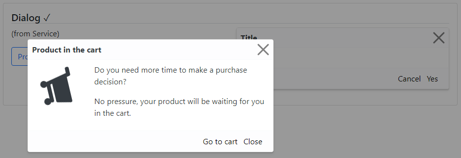

### Readme

> [](../../readme.md)
> [](usage.md)

### Dialog

[](https://krsln.github.io/NgLootBox/Beta/Dialog)  
Dialog is a container to display content in an overlay window. **:p**


#### Dependencies
@import "~@qrsln/lootstrap/scss/lootstrap";  
import {Guid} from '@qrsln/utils/Core';
import {Overlay, Shake} from '@qrsln/utils/Animations';

```shell
npm install --save @qrsln/utils
npm install --save @qrsln/lootstrap

```

#### Properties

Name | Description
 --- | ---  
[] | -

#### Screenshots


