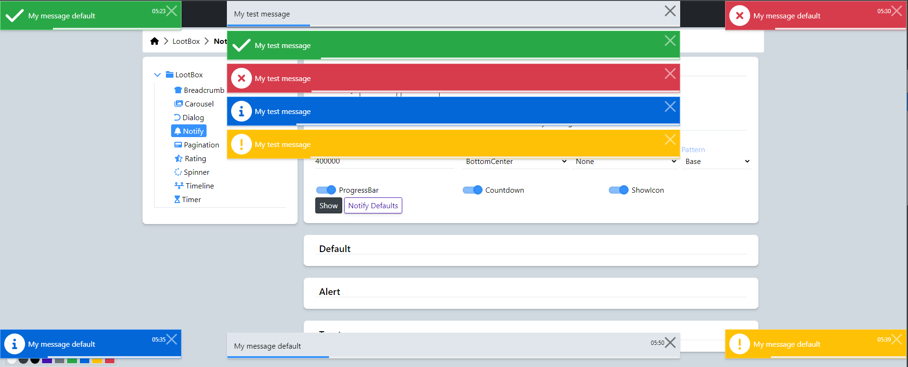

### Notify | Readme

[](../../readme.md)
[](usage.md)
[](https://krsln.github.io/Showcase/LootBox/Notify)

#### Dependencies

```shell
npm install --save @qrsln/utils
npm install --save @qrsln/lootstrap
npm install @fortawesome/fontawesome-free 
```

#### Properties

| Name | Description |
|------|-------------|
| []   | -           |

#### Screenshots


