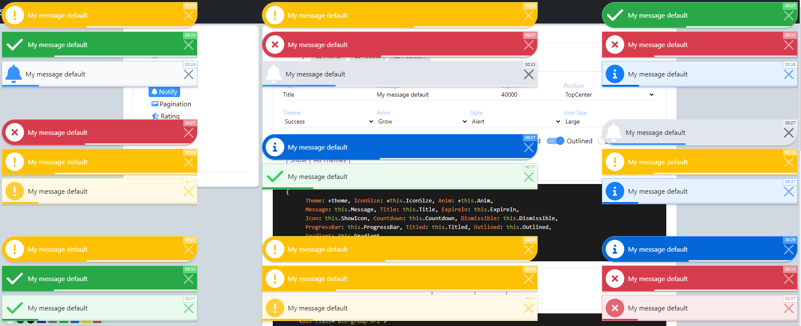

### Notify | Readme

[](../../readme.md)
[](usage.md)
[](https://krsln.github.io/Showcase/LootBox/Notify)

#### Dependencies

```shell
npm install --save @qrsln/utils
npm install --save @qrsln/lootstrap
npm install @fortawesome/fontawesome-free 
```

#### Properties

| Name           | Description                                                                                                  |
|----------------|--------------------------------------------------------------------------------------------------------------|
| NotifyPosition | Top[Left,Center,Right], Middle[Left,Center,Right], Bottom[Left,Center,Right]                                 |
| NotifyTheme    | None, Success, Error, Info, Warning                                                                          |
| NotifyAnim     | Bounce, Grow, Heartbeat, Heartbeat_II, Jello, RubberBand, Shake, ShakeVertical, Spin, SpinCCW, Swing, Wobble |
| NotifyIconSize | Small, Normal, Large                                                                                         |
| NotifyStyle    | Alert, Rounded, Toast                                                                                        |
| Notify         | interface                                                                                                    |
| NotifyItem     | interface                                                                                                    |

```typescript
export interface Notify {
  Id: string;

  Style: NotifyStyle;
  Position: NotifyPosition;

  Item: NotifyItem;
}

export interface NotifyItem {
  Anim: NotifyAnim; 
  IconSize: NotifyIconSize;
  Theme: NotifyTheme;

  Titled: boolean;
  Title: string;

  Message: string;
  ExpireIn: number;

  Icon: boolean;
  Dismissible: boolean;
  Countdown: boolean;

  ProgressBar: boolean;
  Outlined: boolean;
  Gradient: boolean;
}
```

#### Screenshots



