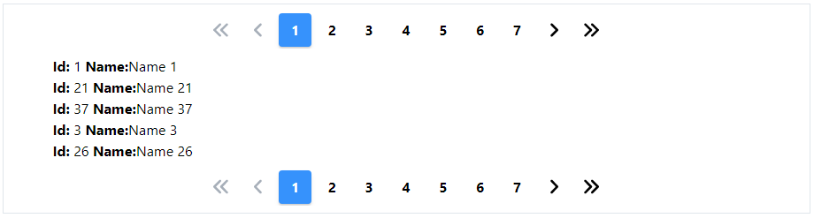

### Readme

> [](../../readme.md)
> [](usage.md)

### Pagination

[](https://krsln.github.io/NgLootBox/LootBox/Pagination)

#### Dependencies
@import "~@qrsln/lootstrap/scss/lootstrap";

```shell
npm install --save @qrsln/lootstrap
npm install @fortawesome/fontawesome-free 
``` 

#### Properties

| Name                      | Description                                                       |
|---------------------------|-------------------------------------------------------------------|
| Items: any[]              | Items that you want to paginate                                   |
| ItemPerPage:number        | The number of items to display on each page. Default is 10        |
| CurrentPage: number       | The current (active) page number.                                 |
| MaxSize:number            | Defines the maximum number of page links to display. Default is 7 |
| PageChanged: EventEmitter | Returns the current page                                          |
| PagedItems: EventEmitter  | Returns the current paged Items                                   |

#### Screenshots


