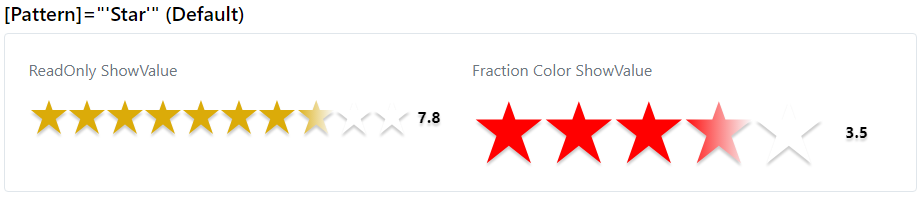
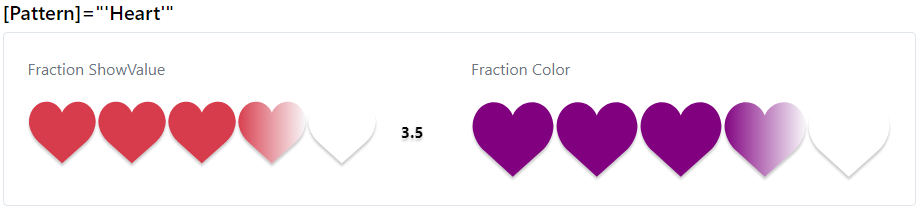
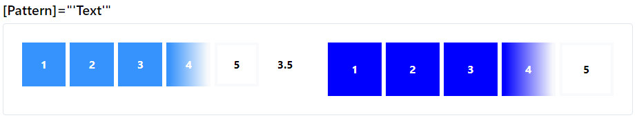
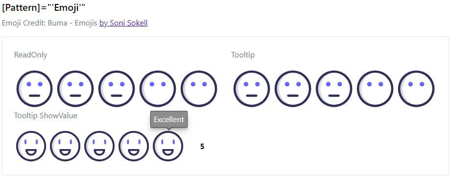

### Rating | Readme

[](../../readme.md)
[](usage.md)
[](https://krsln.github.io/NgLootBox/LootBox/Rating)

#### Dependencies

```shell
npm install --save @qrsln/lootstrap
npm install --save @qrsln/tooltip
```

#### Patterns
Star | Heart | Text | Emoji

#### Properties

| Name                          | Description                                                     |
|-------------------------------|-----------------------------------------------------------------|
| @Input() IsReadOnly: boolean  | Read Only :)                                                    |
| @Input() ShowTooltip: boolean | Show Tooltip                                                    |
| @Input() ShowValue: boolean   | Show rating Value                                               |
| @Input() Fraction: boolean    | allows to click half of unit of rate                            |
| @Input() Pattern: string      | Set the Pattern                                                 |
| @Input() Color: string        | Dynamic color (rgb, hex)                                        |
| @Input() MaxItem: number      | Max rating items                                                |
| @Input() Rate: number         | Current rating                                                  |
| @Output() rateChanged         | Event Emitter<number> ```(rateChanged)="rateChanged($event)"``` |

#### Screenshots
Default & Heart  


Text & Emoji  


