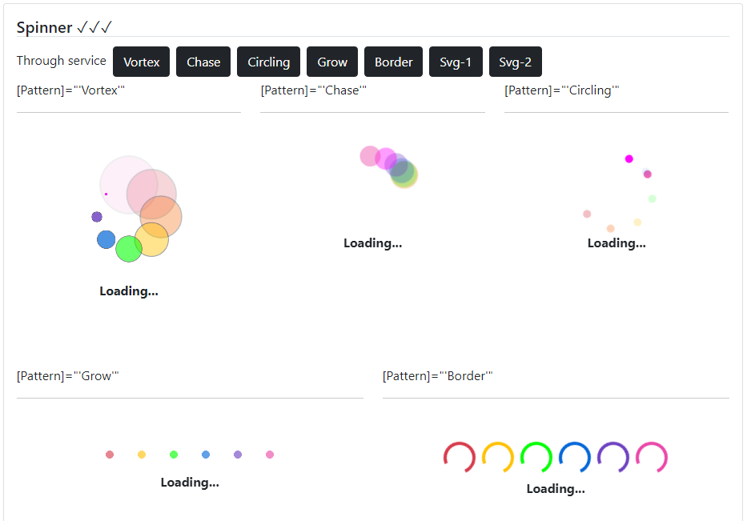

### Readme

> [](../../readme.md)
> [](usage.md)

### Spinner

[](https://krsln.github.io/NgLootBox/LootBox/Spinner)

#### Dependencies
```
 
``` 

#### Properties
_SpinnerService_

Name | Description
 --- | ---  
[Pattern: string] | Default - Bootstrap - Bootstrap-5 - SvgSnake
[Label: string] | -
[IsOverlay: boolean] | -
[ExpireIn?: number] | There is **Hide(spinnerId: string)** method in service

#### Issues
Mobile browser: svg not showing

#### Screenshots


