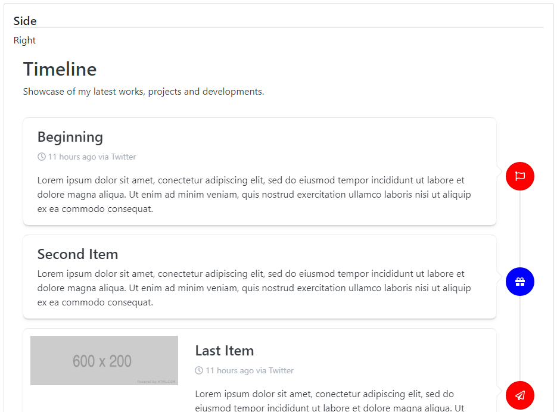
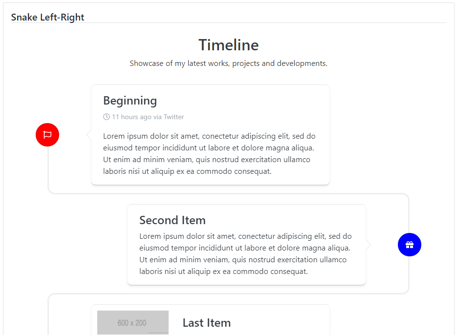
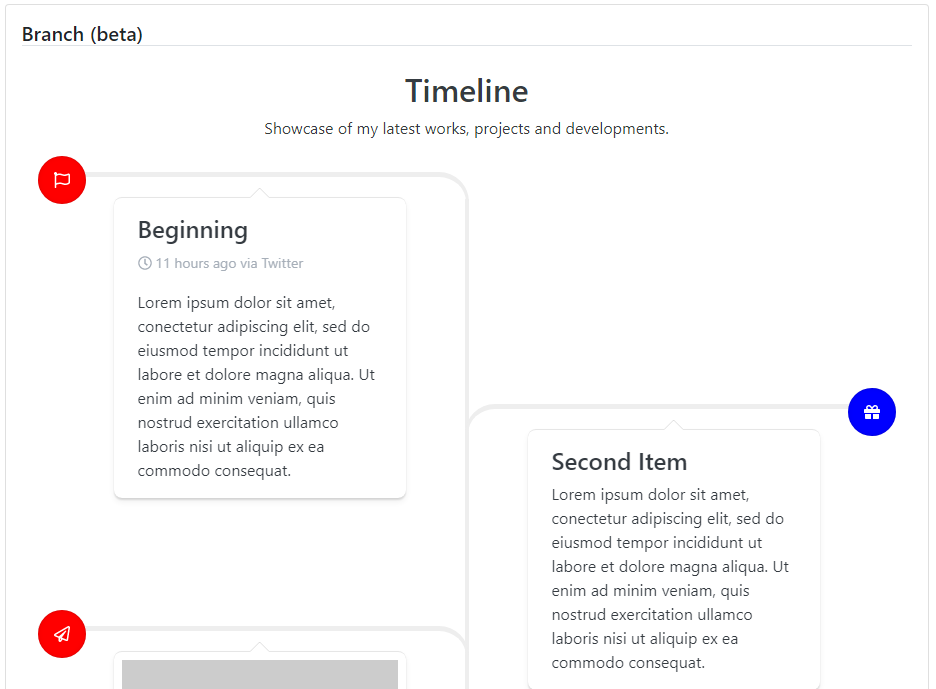

### Readme

> [](../../readme.md)
> [](usage.md)

### Timeline

[](https://krsln.github.io/NgLootBox/LootBox/Timeline)

#### Dependencies

```scss
@import "~@qrsln/lootstrap/scss/lootstrap";   
```

```shell
npm install --save @qrsln/lootstrap
npm install --save @qrsln/tooltip
npm install --save @fortawesome/fontawesome-free
```

#### Properties

Name | Description
 --- | ---  
@Input() Animation: string | shake, expand, bounce, jello
@Input() Layout: string | Default, Side, Snake
@Input() Layout: string | Branch, Zigzag

#### Screenshots
Default  
  
Side & Side-left  
  
Snake  
  
**Betas**  
Branch  
  
