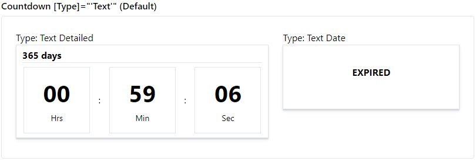
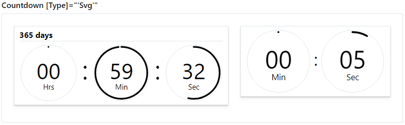
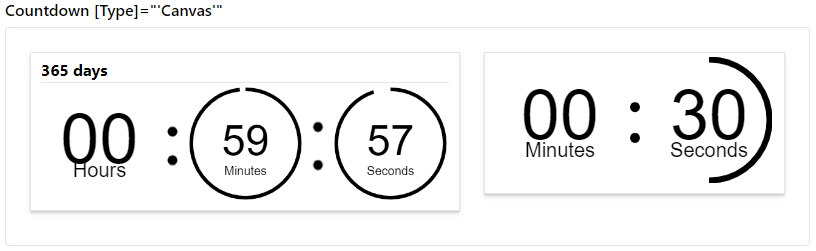

### Timer | Readme

[](../../readme.md)
[](usage.md)
[](https://krsln.github.io/Showcase/LootBox/Timer)

#### Dependencies

```shell
npm install --save @qrsln/lootstrap
```

###### Themes
**_Countdown_**: text | svg | canvas

#### Properties
_TimeAgo Directive_

| Name                     | Description        |
|--------------------------|--------------------|
| @Input() Date: Date      | -                  |
| @Input() Locale: string  | Not working yet    |
| @Input() Suffix: boolean | ago/later suffixes |

_Countdown_

| Name                                                                       | Description               |
|----------------------------------------------------------------------------|---------------------------|
| @Input() Type: string                                                      | Text (default) Canvas Svg |
| @Input() Classes: string                                                   | Css classes               |
| @Input() Date: Date                                                        | -                         |
| @Input() Detailed: { day: number, hrs: number, min: number, sec: number }] | -                         |
 
#### Screenshots
TimeAgo  
  
Countdown-Text    
  
Countdown-Svg  
  
Countdown-Svg-new  
  
Countdown-Canvas  
  
