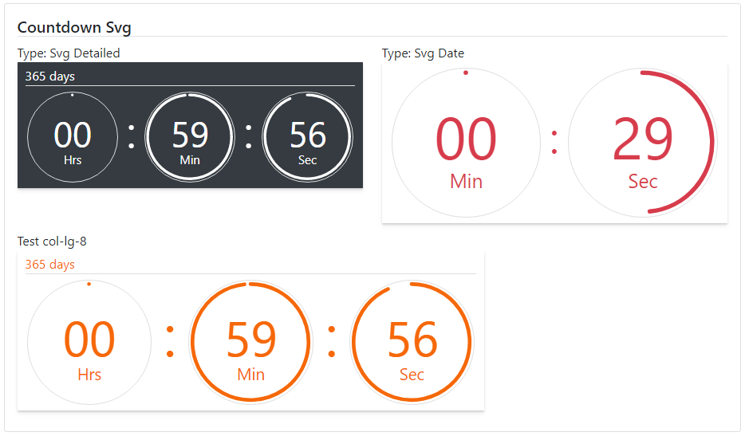

### Readme

> [](../../readme.md)
> [](usage.md)

### Timer

[](https://krsln.github.io/NgLootBox/LootBox/Timers)

#### Dependencies

```scss
@import "~@qrsln/lootstrap/scss/lootstrap";   
```

```
npm install --save @qrsln/lootstrap
```

###### Themes
**_Countdown_**: text | svg | canvas

#### Properties
_TimeAgo Directive_

Name | Description
 --- | ---  
@Input() Date: Date | -
@Input() Locale: string | Not working yet
@Input() Suffix: boolean | ago/later suffixes

_Countdown_

Name | Description
--- | ---  
@Input() Type: string | Text (default) Canvas Svg
@Input() Classes: string | Css classes
@Input() Date: Date | -
@Input() Detailed: { day: number, hrs: number, min: number, sec: number }] | -

#### Issues
Mobile browser: canvas size

#### Screenshots
TimeAgo  
  
Countdown-Text    
  
Countdown-Svg  
  
Countdown-Svg-new  
  
Countdown-Canvas  
  
