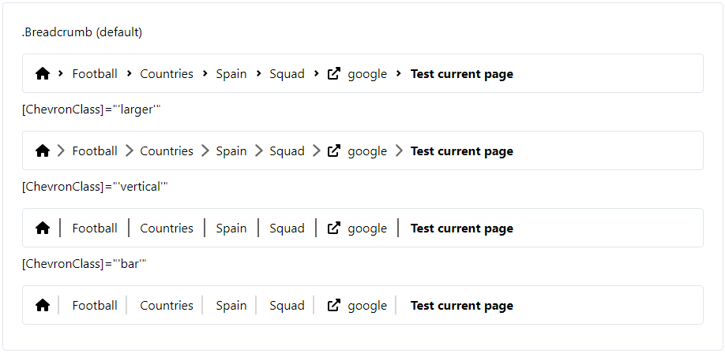
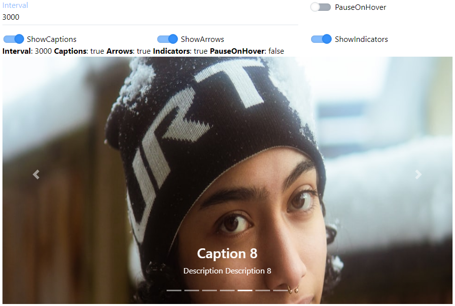
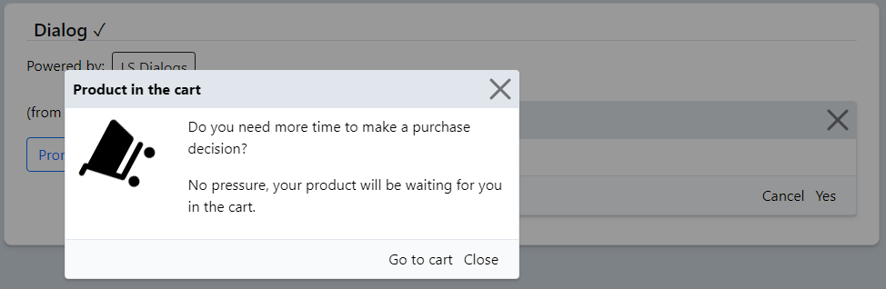
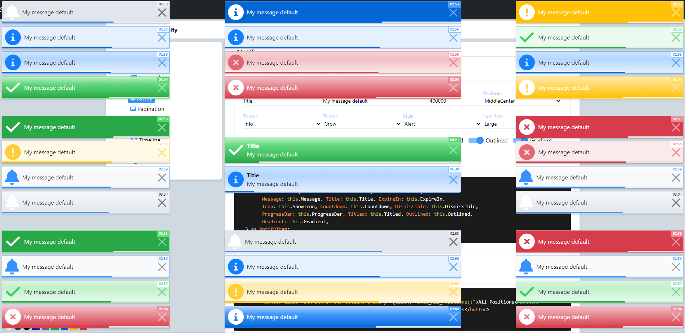
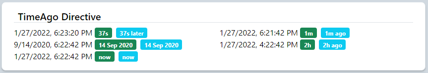
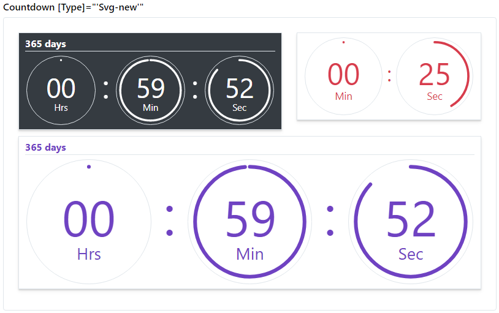
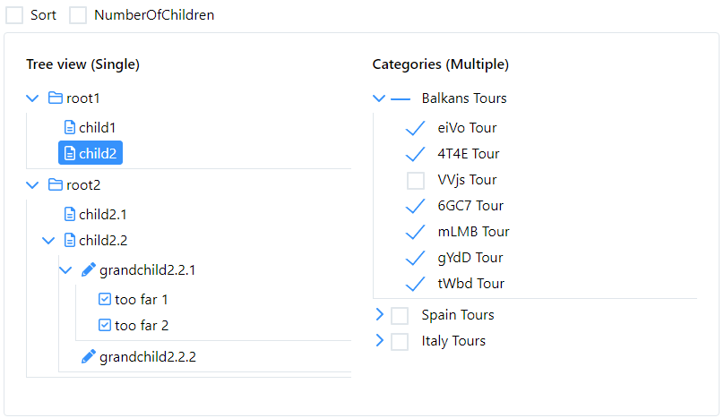

## LootBox

[](https://www.patreon.com/qrsln)
[](https://www.npmjs.com/package/@qrsln/loot-box)
[](https://npmcharts.com/compare/@qrsln/loot-box?minimal=true)

> For Angular

[](../projects.md)
[](https://krsln.github.io/Showcase/LootBox)

## Quick start

- Install with [npm](https://www.npmjs.com/): `npm install @qrsln/loot-box`
- Install with [yarn](https://yarnpkg.com/): `yarn add @qrsln/loot-box`

## Styles

Powered by [LootStrap](https://github.com/krsln/LootStrap)

angular.json

````json
{
  "styles": [
    "node_modules/@qrsln/loot-box/Styles/LootStrap.css"
  ]
}
````

## Showcase

- LootBox
  - [Breadcrumb](#breadcrumb)
  - [Carousel](#carousel)
  - [Dialog](#dialog)
  - [Notify](#notify)
  - [Pagination](#pagination)
  - [Rating](#rating)
  - [Spinner](#spinner)
  - [Timeline](#timeline)
  - [Timer](#timer)
  - [TreeView](#treeview)

### Breadcrumb

[](https://krsln.github.io/Showcase/LootBox/Breadcrumb)
[](Libs/Breadcrumb/readme.md)
[](Libs/Breadcrumb/usage.md)



*[](#showcase)*

### Carousel

[](https://krsln.github.io/Showcase/LootBox/Carousel)
[](Libs/Carousel/readme.md)
[](Libs/Carousel/usage.md)



*[](#showcase)*

### Dialog

[](https://krsln.github.io/Showcase/LootBox/Dialog)
[](Libs/Dialog/readme.md)
[](Libs/Dialog/usage.md)



*[](#showcase)*

### Notify

[](https://krsln.github.io/Showcase/LootBox/Notify)
[](Libs/Notify/readme.md)
[](Libs/Notify/usage.md)



*[](#showcase)*

### Pagination

[](https://krsln.github.io/Showcase/LootBox/Pagination)
[](Libs/Pagination/readme.md)
[](Libs/Pagination/usage.md)


*[](#showcase)*

### Rating

[](https://krsln.github.io/Showcase/LootBox/Rating)
[](Libs/Rating/readme.md)
[](Libs/Rating/usage.md)


*[](#showcase)*

### Spinner

[](https://krsln.github.io/Showcase/LootBox/Spinner)
[](Libs/Spinner/readme.md)
[](Libs/Spinner/usage.md)


*[](#showcase)*

### Timeline

[](https://krsln.github.io/Showcase/LootBox/Timeline)
[](Libs/Timeline/readme.md)
[](Libs/Timeline/usage.md)


*[](#showcase)*

### Timer

[](https://krsln.github.io/Showcase/LootBox/Timer)
[](Libs/Timer/readme.md)
[](Libs/Timer/usage.md)

  


*[](#showcase)*

### TreeView

[](https://krsln.github.io/Showcase/LootBox/TreeView)
[](Libs/TreeView/readme.md)
[](Libs/TreeView/usage.md)

  

*[](#showcase)*

