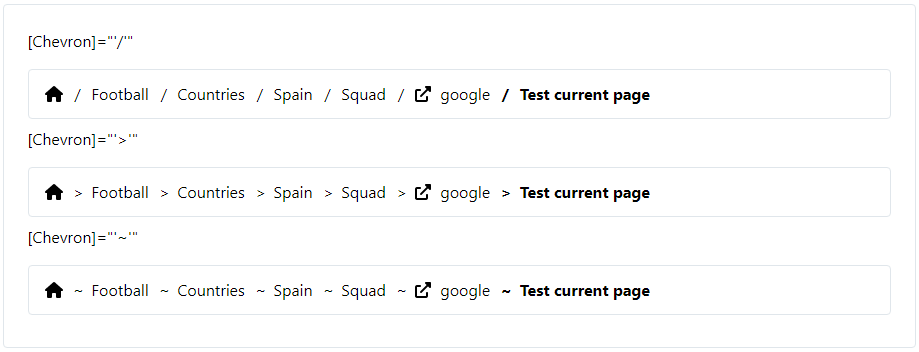

### Readme

> 
> 
> 
> 

## LootBox

For Angular  

### Progress

| *Perfect*                                            | *Done*                                               | *Almost*                                             | *Works*                                              | *Basic*                                              | *Started*                                            |
|------------------------------------------------------|------------------------------------------------------|------------------------------------------------------|------------------------------------------------------|------------------------------------------------------|------------------------------------------------------|
|  |  |  |  |  |  |

## Contents

| Module                    | Progress                                             |
|---------------------------|------------------------------------------------------|
| [Breadcrumb](#breadcrumb) |  |
| [Carousel](#carousel)     |  |
| [Dialog](#dialog)         |  |
| [Notify](#notify)         |  |
| [Pagination](#pagination) |  |
| [Rating](#rating)         |  |
| [Spinner](#spinner)       |  |
| [Timeline](#timeline)     |  |
| [Timer](#timer)           |  |

## Quick start

- Install with [npm](https://www.npmjs.com/): `npm install @qrsln/loot-box`
- Install with [yarn](https://yarnpkg.com/): `yarn add @qrsln/loot-box`

## Details

### Breadcrumb

**

### Carousel

**

### Dialog

**

### Notify

**

### Pagination

**

### Rating

**

### Spinner

**

### Timeline

**

### Timer

  

**
