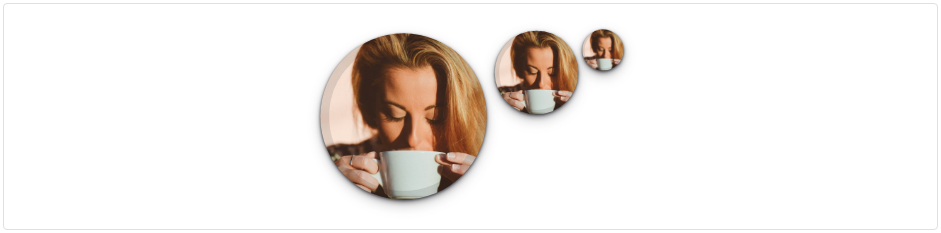
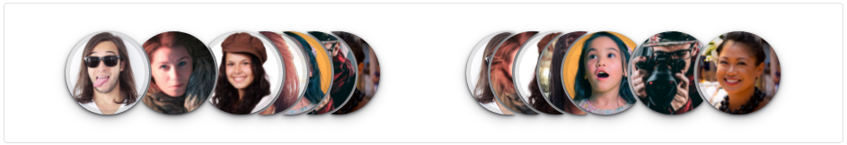
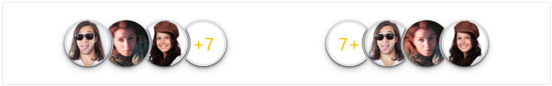

### Avatar | Readme

#### Dependencies

- Lootstrap css library

#### Properties

> Avatar

| Name      | Description                                 |
|-----------|---------------------------------------------|
| [Img]     | Image url                                   |
| [Alt]     | Title                                       |
| [Letter]  | Can be used with letters (max 3)            |
| [BgColor] | Color of avatar background                  |
| [Variant] | Square, Rounded, Circle                     |
| [Anchor]  | Top, Bottom, None                           |
| [Online]  | Green badge color. Default value: ``false`` |

> Avatar Group

| Name       | Description              |
|------------|--------------------------|
| [ImgList]  | Images url               |
| [Reversed] | Default value: ``false`` |
| [More]     | Default value: ``false`` |

#### Screenshots

