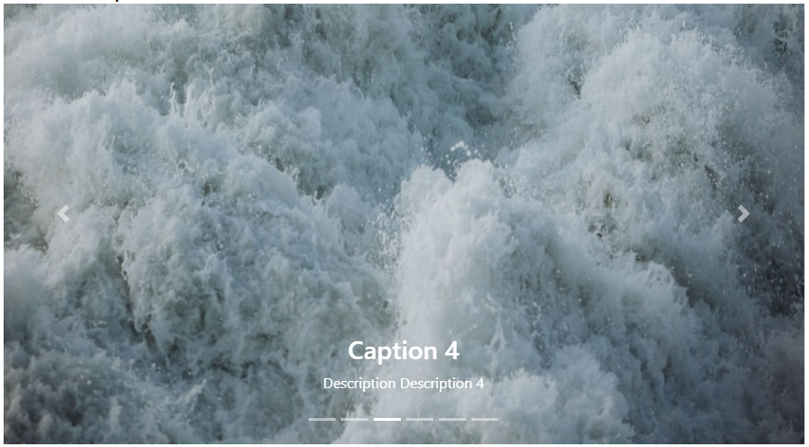

### Carousel | Readme

#### Dependencies

- Lootstrap css library

#### Properties

> Avatar

| Name                   | Description                                                                                          |
|------------------------|------------------------------------------------------------------------------------------------------|
| [Images]               | Images                                                                                               |
| [Interval]             | Time in `milliseconds` before the next slide is shown. Default value: ``6000``                       |
| [Captions]             | If `true`, captions will be visible. Default value: ``true``                                         |
| [NavigationArrows]     | If true, `previous` and `next` navigation arrows will be visible on the slide. Default value: `true` |
| [NavigationIndicators] | If `true`, navigation indicators at the bottom of the slide will be visible. Default value: `true`   |
| [Dummy]                | With dummy images for the test purpose, Default value: ``false``                                     |
| [PauseOnHover]         | If `true`, will pause slide switching when mouse cursor hovers the slide. Default value: ``false``   |
| [Stats]                | default is ``false``                                                                                 |

#### Screenshots

