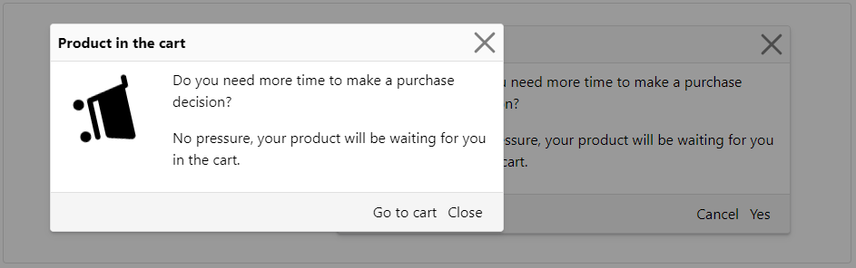

### Dialog | Readme

#### Dependencies

- Lootstrap css library

#### Properties

> Dialog Component

| Name      | Description              |
|-----------|--------------------------|
| [Content] | Dialog Title & InnerHtml |
| [Footer]  | Redirect Href            |
| [Forced]  | Default value: ``false`` |
 

> Dialog Service - Methods

| Name     | Description                                                           |
|----------|-----------------------------------------------------------------------|
| Prompt   | (Content: DialogContent, Forced = false)                              |
| Redirect | (Content: DialogContent, Href: string, Label: string, Forced = false) |

#### Screenshots

 
