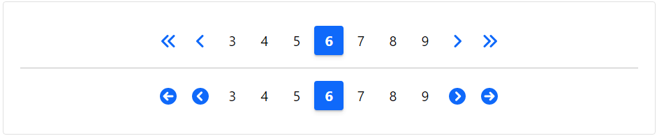

### Pagination | Readme

#### Dependencies

- Lootstrap css library

#### Properties

| Name          | Description                                                           |
|---------------|-----------------------------------------------------------------------|
| [Shape]       | 'Srq' 'Circle'                                                        |
| [Items]       | Items that you want to paginate                                       |
| [ItemPerPage] | The number of items to display on each page                           |
| [CurrentPage] | The current (active) page number.                                     |
| [MaxSize]     | Defines the maximum number of page links to display. Default is ``6`` |
| [PageChanged] | (EventEmitter) Returns the current page                               |
| [PagedItems]  | (EventEmitter) Returns the current paged Items                        |
 
#### Screenshots

