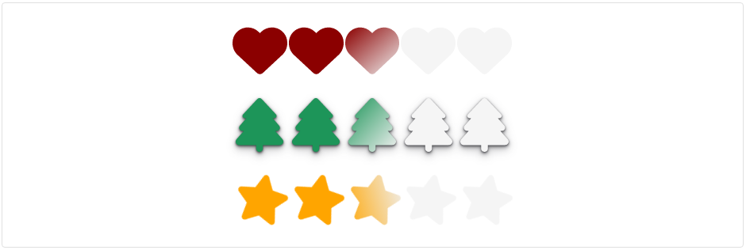
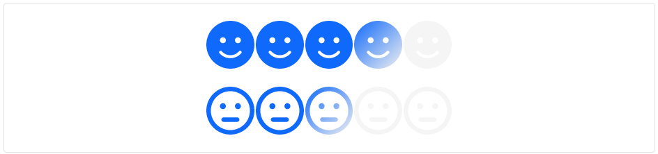

### Rating | Readme

#### Dependencies

- Lootstrap css library

#### Properties

| Name          | Description                                       |
|---------------|---------------------------------------------------|
| [Fraction]    | Allows to click half of unit of rate              |
| [ReadOnly]    | Read Only :)                                      |
| [Shadow]      | Allow drop shadow to items                        |
| [Pattern]     | 'Customized', 'base'                              |
| [Icons]       | Use with other icon libraries                     |
| [ShowValue]   | Show rating Value                                 |
| [Rate]        | Current rating                                    |
| [RateChanged] | Event Emitter (RateChanged)="rateChanged($event)" |

#### Screenshots

