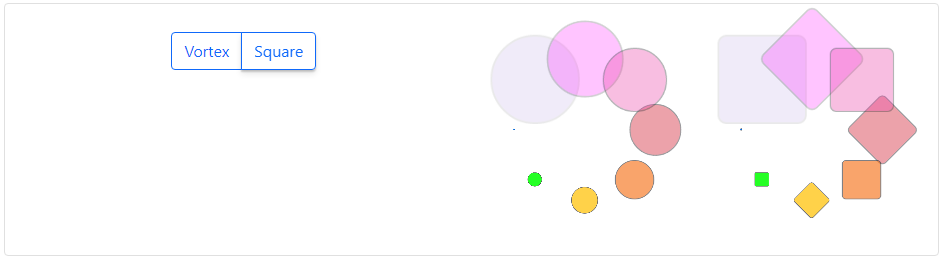

### Spinner | Readme

#### Dependencies

- Lootstrap css library

#### Properties

| Name       | Description                                |
|------------|--------------------------------------------|
| [Pattern]  | Vortex, VortexSqr, Grow, Border            |
| [Overlay]  | overlay effect                             |
| [Color]    | Default, Adaptive (based on theme)         |
| [ExpireIn] | Automatically expires if set, milliseconds |
| [Label]    | Label bottom of spinner                    |

#### Screenshots

 
