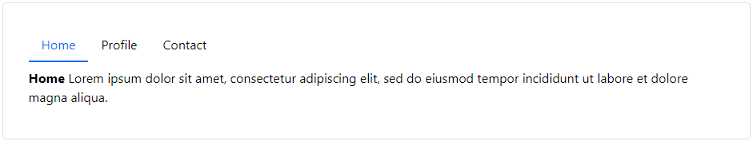
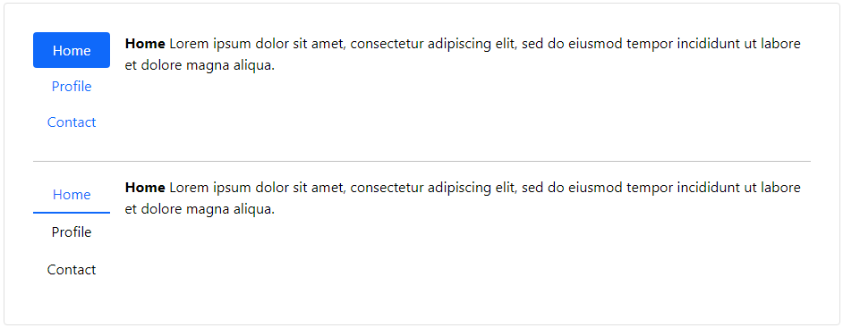

### Tabs | Readme

#### Dependencies

- Lootstrap css library

#### Properties

> Tabs

| Name       | Description              |
|------------|--------------------------|
| [Design]   | Tab, Pill, Material      |
| [Vertical] | Default value: ``false`` |
 
> TabPane

| Name       | Description              |
|------------|--------------------------|
| [Label]    | Tab title                |
| [Anim]     | FadeIn, BounceIn, ZoomIn |
| [Active]   | Default value: ``false`` |
| [Disabled] | Default value: ``false`` |

#### Screenshots

