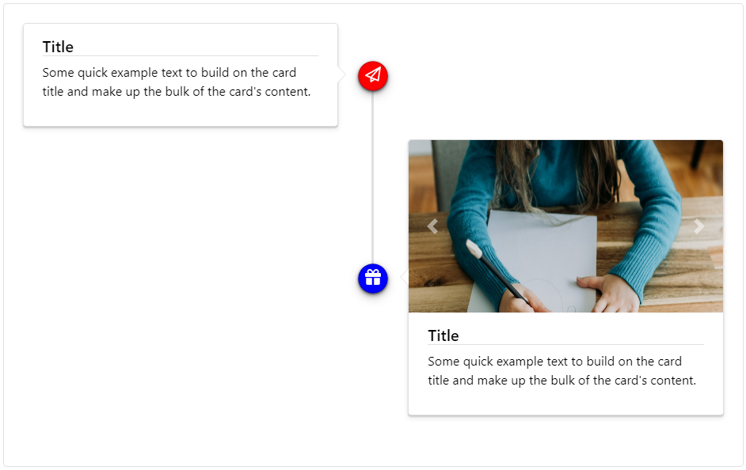

### Timeline | Readme

#### Dependencies

- Lootstrap css library

#### Properties

> Timeline

| Name     | Description                                      |
|----------|--------------------------------------------------|
| [Anim]   | 'Shake' 'Rubber-band' 'Wobble' 'Jello' undefined |
| [Layout] | 'Side' 'Centered' 'Connected'                    |

> TimelineItem

| Name       | Description              |
|------------|--------------------------|
| [Inverted] | Default value: ``false`` |

#### Screenshots

