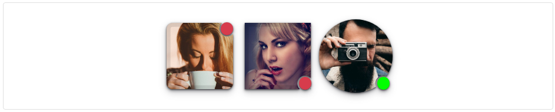
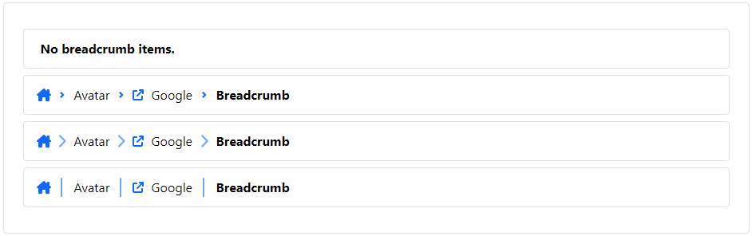
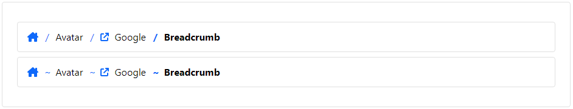
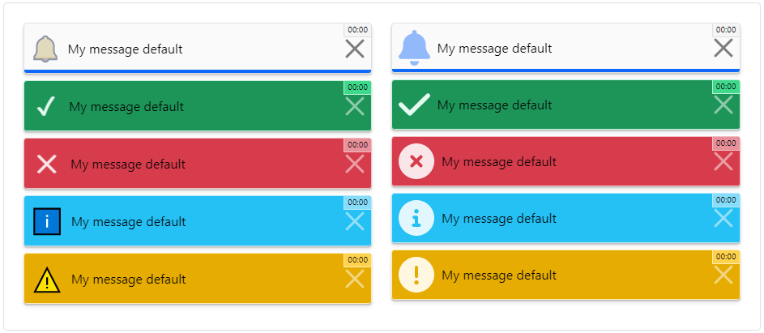
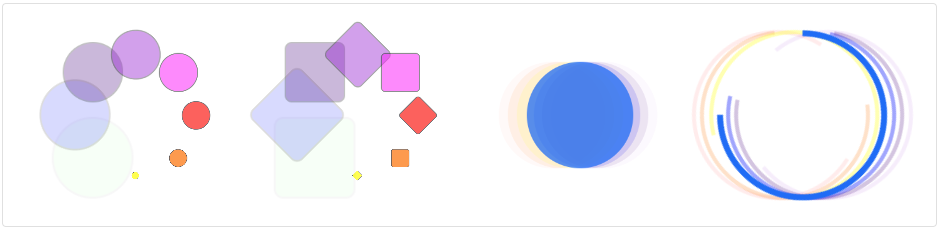
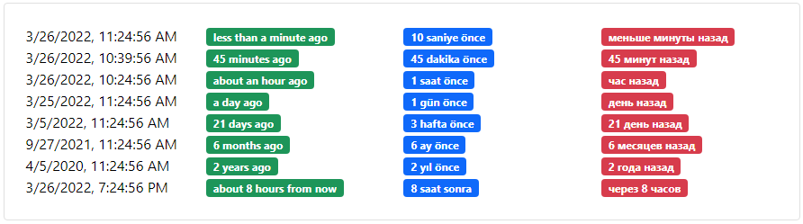
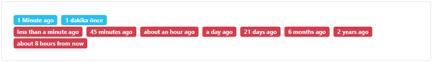
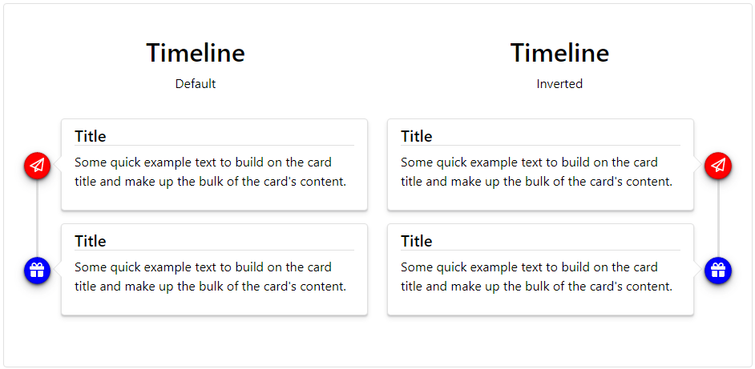
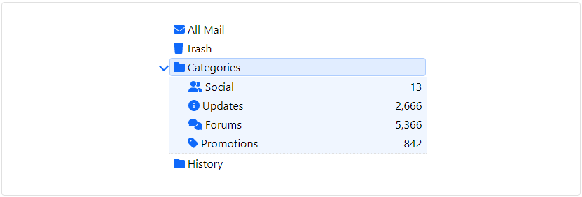

## Lootstrap Angular

[](https://www.patreon.com/qrsln)
[](https://www.npmjs.com/package/@qrsln/lootstrap-angular)
[](https://npmcharts.com/compare/@qrsln/lootstrap-angular?minimal=true)

> For Angular

[](https://krsln.github.io/Showcase/LootstrapNg)
[](https://github.com/krsln/Showcase/blob/master/Docs/Libraries/LootstrapNg)

## Quick start

- Install with [npm](https://www.npmjs.com/): `npm install @qrsln/lootstrap-angular`
- Install with [yarn](https://yarnpkg.com/): `yarn add @qrsln/lootstrap-angular`

## Styles

Powered by [LootStrap](https://github.com/krsln/LootStrap)

angular.json

````json
{
  "styles": [
    "node_modules/@qrsln/lootstrap-angular/Styles/LootStrap.css"
  ]
}
````

## Showcase

- LootstrapNg
  - [Avatar](#avatar)
  - [Card](#card)
  - [Breadcrumb](#breadcrumb)
  - [Carousel](#carousel)
  - [Dialog](#dialog)
  - [Notify](#notify)
  - [Pagination](#pagination)
  - [Rating](#rating)
  - [Spinner](#spinner)
  - [Tabs](#tabs)
  - [TimeAgo](#timeago)
  - [Timeline](#timeline)
  - [Timer](#timer)
  - [TreeView](#treeview) TODO

### Avatar

[](https://krsln.github.io/Showcase/LootstrapNg/Avatar)
[](Libs/Avatar/readme.md)
[](Libs/Avatar/usage.md)




*[](#showcase)*

### Breadcrumb

[](https://krsln.github.io/Showcase/LootstrapNg/Breadcrumb)
[](Libs/Breadcrumb/readme.md)
[](Libs/Breadcrumb/usage.md)




*[](#showcase)*

### Card

[](https://krsln.github.io/Showcase/LootstrapNg/Card)
[](Libs/Card/readme.md)
[](Libs/Card/usage.md)


*[](#showcase)*

### Carousel

[](https://krsln.github.io/Showcase/LootstrapNg/Carousel)
[](Libs/Carousel/readme.md)
[](Libs/Carousel/usage.md)


*[](#showcase)*

### Dialog

[](https://krsln.github.io/Showcase/LootstrapNg/Dialog)
[](Libs/Dialog/readme.md)
[](Libs/Dialog/usage.md)


*[](#showcase)*

### Notify

[](https://krsln.github.io/Showcase/LootstrapNg/Notify)
[](Libs/Notify/readme.md)
[](Libs/Notify/usage.md)



*[](#showcase)*

### Pagination

[](https://krsln.github.io/Showcase/LootstrapNg/Pagination)
[](Libs/Pagination/readme.md)
[](Libs/Pagination/usage.md)


*[](#showcase)*

### Rating

[](https://krsln.github.io/Showcase/LootstrapNg/Rating)
[](Libs/Rating/readme.md)
[](Libs/Rating/usage.md)


*[](#showcase)*

### Spinner

[](https://krsln.github.io/Showcase/LootstrapNg/Spinner)
[](Libs/Spinner/readme.md)
[](Libs/Spinner/usage.md)



*[](#showcase)*

### Tabs

[](https://krsln.github.io/Showcase/LootstrapNg/Tabs)
[](Libs/Tabs/readme.md)
[](Libs/Tabs/usage.md)


*[](#showcase)*

### TimeAgo

[](https://krsln.github.io/Showcase/LootstrapNg/Time)
[](Libs/TimeAgo/readme.md)
[](Libs/TimeAgo/usage.md)




*[](#showcase)*

### Timeline

[](https://krsln.github.io/Showcase/LootstrapNg/Timeline)
[](Libs/Timeline/readme.md)
[](Libs/Timeline/usage.md)

 


*[](#showcase)*

### Timer

[](https://krsln.github.io/Showcase/LootstrapNg/Time)
[](Libs/Timer/readme.md)
[](Libs/Timer/usage.md)


*[](#showcase)*

### TreeView

[](https://krsln.github.io/Showcase/LootstrapNg/TreeView)
[](Libs/TreeView/readme.md)
[](Libs/TreeView/usage.md)



*[](#showcase)*

