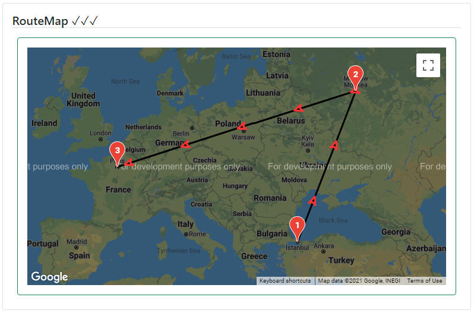

### Readme

> [](usage.md)

### Mapper
[](https://krsln.github.io/NgLootBox/Libraries/Mapper)
[](../projects.md)

#### Dependencies
```
npm install @angular/google-maps 
```

#### Properties

Name | Description
 --- | ---  
[Options:MapperOption] | Check usage page

### Screenshots

Mapper Basic  
  
Mapper RouteMap
  
