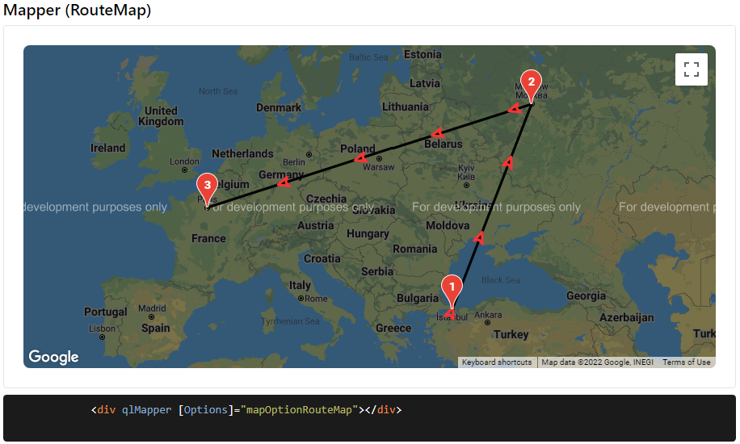

## Mapper

[](https://www.patreon.com/qrsln)
[](https://npmcharts.com/compare/@qrsln/mapper?minimal=true)
[](https://badge.fury.io/js/%40qrsln%2Fmapper)

> For Angular

[](https://krsln.github.io/Showcase/Libraries/Mapper)
[](../projects.md)
[](usage.md)

#### Dependencies

```shell
npm install @angular/google-maps 
```

#### Properties

| Name                   | Description      |
|------------------------|------------------|
| [Options:MapperOption] | Check usage page |

### Screenshots

  
  
