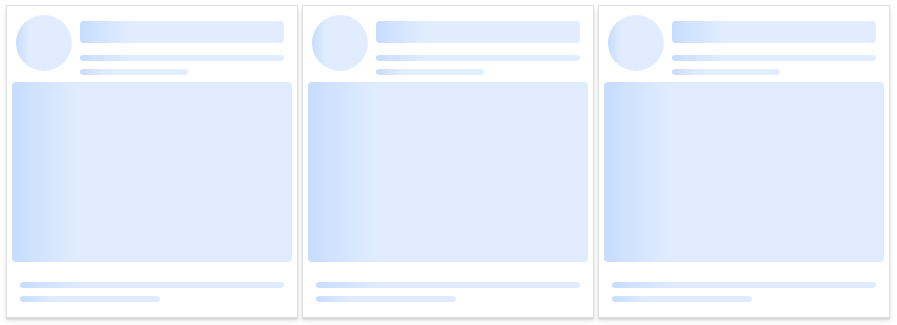
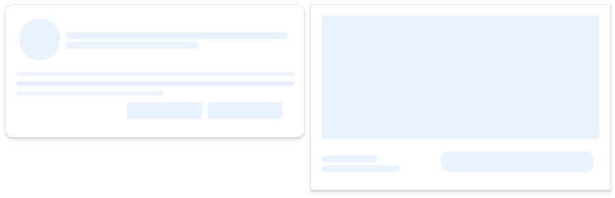

## Skeleton

[](https://www.patreon.com/qrsln)
[](https://npmcharts.com/compare/@qrsln/skeleton?minimal=true)
[](https://badge.fury.io/js/%40qrsln%2Fskeleton)

> For Angular

[](https://krsln.github.io/Showcase/Libraries/Skeleton)
[](../projects.md)
[](usage.md)

#### Dependencies

```scss
```

#### Properties

| Name            | Description                       |
|-----------------|-----------------------------------|
| [ClassName]     | To use custom css class           |
| [Anim]          | 'None' 'Pulse' 'Shine'            |
| [Height:number] | Height of media component (Pixel) |
| [Count:number]  | Lines of paragraph                |
| [Circle:bool]   | For square component              |

#### Screenshots



