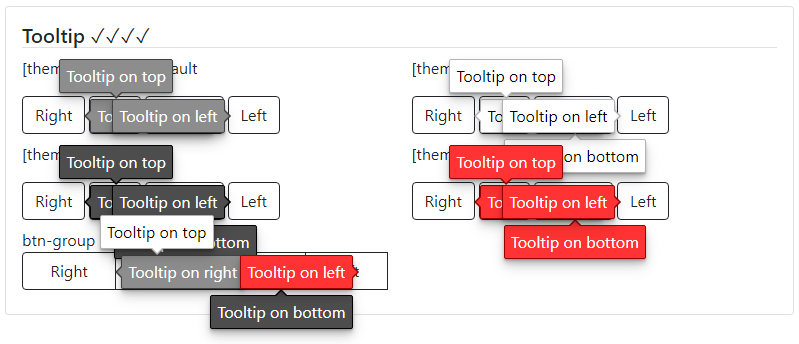

### Readme

> [](usage.md)

### Tooltip

[](https://krsln.github.io/NgLootBox/Libraries/Tooltip)
[](../projects.md)


#### Dependencies

```scss
```

#### Themes

white | black | silver | red

#### Properties

Name | Description
 --- | ---  
qlTooltip="..." | content
[placement:string] | top right bottom left
[theme:string] | white black silver red
[duration:number] | 500ms is default

#### Screenshots


