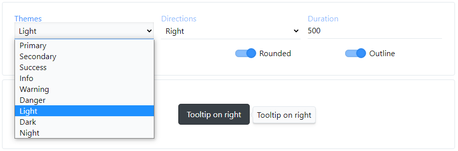
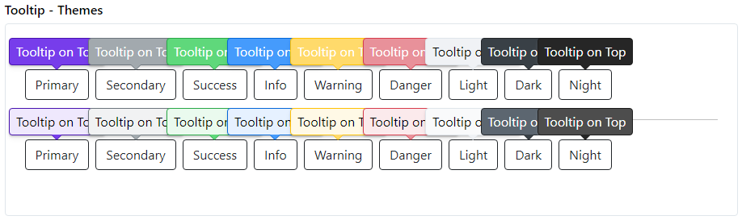

## Tooltip

[](https://www.patreon.com/qrsln)
[](https://www.npmjs.com/package/@qrsln/tooltip)
[](https://npmcharts.com/compare/@qrsln/tooltip?minimal=true)

> For Angular

[](https://krsln.github.io/Showcase/Libraries/Tooltip)
[](../projects.md)
[](usage.md)

#### Dependencies

```scss
```

#### Themes

primary secondary success info warning danger light (default) dark night

#### Properties

| Name               | Description                                                              |
|--------------------|--------------------------------------------------------------------------|
| qlTooltip="..."    | content                                                                  |
| [rounded:boolean]  | rounded corners                                                          |
| [outline:boolean]  | outline style                                                            |
| [placement:string] | top right bottom left                                                    |
| [theme:string]     | primary secondary success info warning danger light (default) dark night |
| [duration:number]  | 500ms is default                                                         |

#### Screenshots



