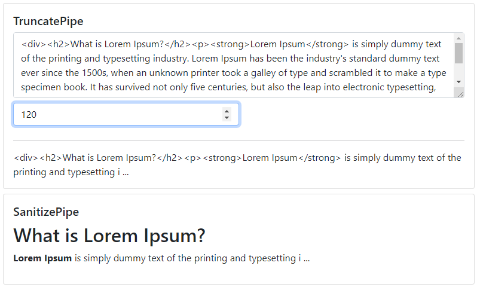

# @qrsln/utils

## Utils

For Angular  

## Contents

Utils | Progress
--- | ---
Animations | * 
[Animations](#animations) | 
Core | * 
[Guid](#guid--stopwatch) | 
[Stop Watch](#guid--stopwatch) | 
Pipes | * 
[Truncate](#truncate--sanitize) | 
[Sanitize](#truncate--sanitize) | 
Services | * 
[Dom Service](#dom--webstorage) | 
[WebStorage Service](#dom--webstorage) | 

## Details

### Animations

Shake, ShakeAuto, ShrinkOut, FadeInOut, FlyInOut, Overlay

**

### Core

#### Guid & StopWatch

**

#### Truncate & Sanitize

Pipe ( | qlTruncate)  
Pipe ( | qlSanitize)

**

### Services

#### Dom & WebStorage

**

