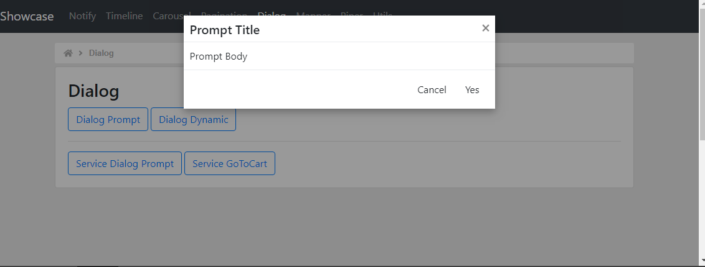

# Dialog
Dialog is a container to display content in an overlay window.
 
## Notes
https://primefaces.org/primeng/#/dialog  
https://mdbootstrap.com/docs/angular/modals/basic/  

## TODOs

## Screenshots

