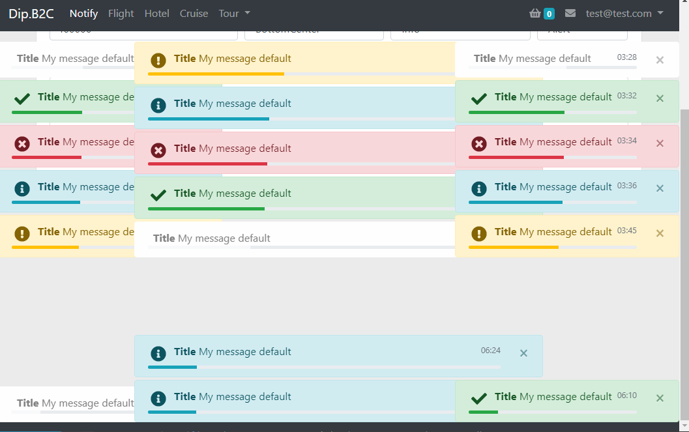

# Notify (✓✓✓✓)

## Depends 
Needs:  
`npm install bootstrap @fortawesome/fontawesome-free`
inLayout: `<lb-notify></lb-notify>`  

import {AnimOverlay, flyInOut, shrinkOut} from '../../../../Animations/index';


```
alert, toast: "bootstrap": "^4.4.1",  
all:          "@fortawesome/fontawesome-free": "^5.11.2"  
```

scss @import "./../../../variables";

## Notes  
done! TODO: Positioning   
fixed! TODO: center left:40% is not ideal   
~~done!~~ TODO: anim but not ideal

##Making it Work
Usage: Service (NotifyService)  
Usage: Component (lb-notify)  

####Step One
_lb-toaster Has to be placed in layout_
````
<!--Header-->
<app-header></app-header>
<lb-notify></lb-notify>
<!--Main Content-->
<main>
  <router-outlet></router-outlet>
</main>
<!--Footer-->
<app-footer></app-footer>
````

####Step Two  
###### Ts
```
constructor( private notifyService: NotifyService ) {}

ngOnInit() {
    this.notifyService.None('My test message', 5000, NotifyPosition.TopRight);
    this.notifyService.Success('My test message', 4000, NotifyPosition.TopRight);
    this.notifyService.Error('My test message', 5000, NotifyPosition.TopRight);
    this.notifyService.Info('My test message', 8000, NotifyPosition.TopRight);
    this.notifyService.Warning('My test message', 5000, NotifyPosition.TopRight);
}
```

 
## Screenshots 
Notify  
 

Based  
 

Alert  
 

Toast  
 


##### Html Templates
[positioning.html](Templates/template-positioning.html)  
[notify-alert-bs.html](Templates/template-notify-alert-bs.html)  
[notify-toast-bs.html](Templates/template-notify-toast-bs.html)  
[notify-custom.html](Templates/template-notify-custom.html)  

