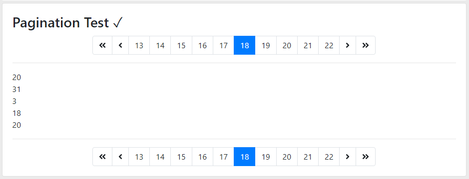

# Pagination

## Depends
 
## Usage
Component (lb-pagination)  

###### Html
```
  <div class="card card-body">
    <h3 class="card-title">Pagination Test ✓</h3>
    <lb-pagination [Items]="Items" [CurrentPage]="Pager.CurrentPage" [PageSize]="5"
                   (PagedItems)="Pager.Items = $event" #pagination
                   (CurrentPageChanged)="Pager.CurrentPage=$event"></lb-pagination>
    <hr>
    <div *ngFor="let item of Pager.Items">
      {{item}}
    </div>
    <hr>
    <lb-pagination [Items]="Items" [CurrentPage]="Pager.CurrentPage" [PageSize]="5"
                   (PagedItems)="Pager.Items = $event"
                   (CurrentPageChanged)="Pager.CurrentPage=$event"></lb-pagination>
  </div>
```
###### Ts
```
  Pager = {CurrentPage: 1, Items: []};
  Items: any[]; 

  ngOnInit() {
    // randomly generated N = 40 length array 0 <= A[N] <= 39
    this.Items = Array.from({length: 40}, () => Math.floor(Math.random() * 40));
  }
```  

## TODOs 

## Screenshots
 
