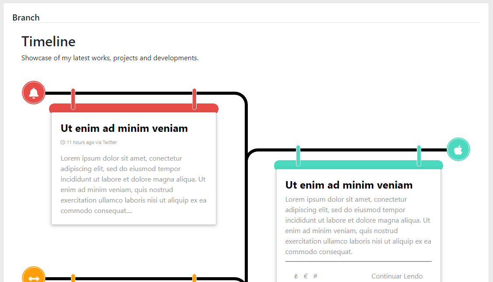
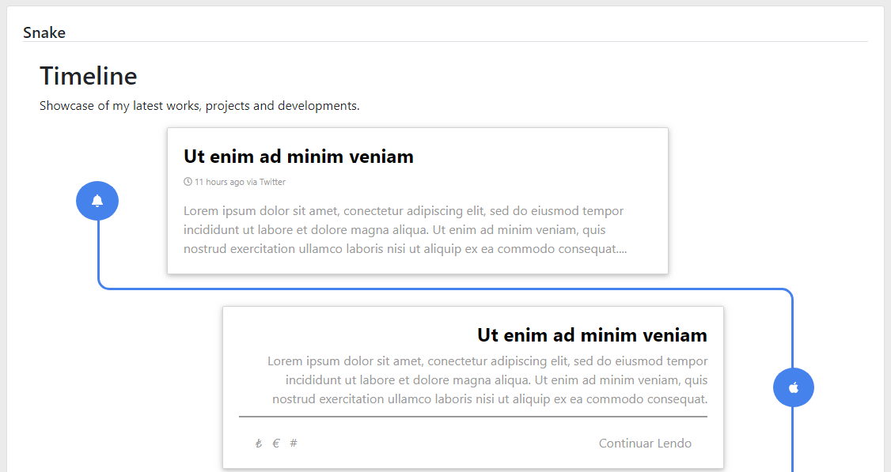

# Timeline ✓✓✓✓

## Depends 
TooltipModule,

## Usage
Component (lb-timeline)  

###### Html
```
<lb-timeline [Theme]="'Default'" [Model]="Model" [Animation]="'shake'"></lb-timeline>
<lb-timeline [Theme]="'Side'" [Model]="Model" [Animation]="'expand'"></lb-timeline>
<lb-timeline [Theme]="'Zigzag'" [Model]="Model"></lb-timeline>
<lb-timeline [Theme]="'Snake'" [Model]="Model"></lb-timeline>
<lb-timeline [Theme]="'Branch'" [Model]="Model"></lb-timeline>
```
###### Ts
```
 ngOnInit() {
    this.Model = {
      Title: 'Timeline',
      Description: 'Showcase of my latest works, projects and developments.',
      Right: false,
      Cards: [
        {
          Title: 'Ut enim ad minim veniam',
          Subtitle: '11 hours ago via Twitter',
          Content: 'Lorem ipsum dolor sit amet, conectetur adipiscing elit, sed do eiusmod tempor incididunt ut labore et dolore magna aliqua. Ut enim ad minim veniam, quis nostrud exercitation ullamco laboris nisi ut aliquip ex ea commodo consequat.Lorem ipsum dolor sit amet, conectetur adipiscing elit, sed do eiusmod tempor incididunt ut labore et dolore magna aliqua. Ut enim ad minim veniam, quis nostrud exercitation ullamco laboris nisi ut aliquip ex ea commodo consequat.',
          Badge: {
            FaClass: 'fas fa-bell',
            BgColor: 'red',
          } as TimelineBadge
        } as TimelineCard,
```
 
## Notes
https://angularfirebase.com/snippets/animate-a-component-based-on-scroll-position-angular-4-2/   
https://mdbootstrap.com/plugins/angular/timeline/#animated   

###### Themes  
Default | Side | Zigzag | Snake | Branch  

###### Animations  
shake  | expand


## TODOs
Default  
  
Branch  
  
Side  
  
Snake  
  

