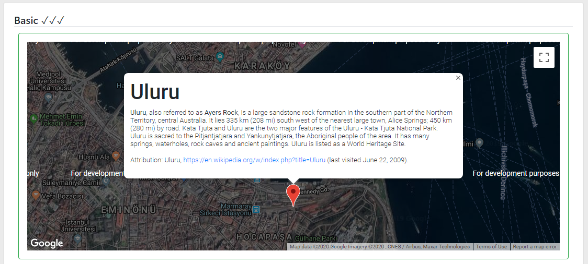

# Mapper ✓✓✓

## Depends
Needs: `npm install @angular/google-maps`  

## Usage
Directive (lbMapper)  

###### Html
```
index.html
<script src="https://maps.googleapis.com/maps/api/js?key=YOUR_API_KEY"></script>
```
```
Basic 
<div lbMapper [Options]="mapOption2"></div>

RouteMap 
<div lbMapper [Options]="mapOption1"></div>
```
###### Ts
```
  mapOption2: MapperOption = {
    type: MapperType.Basic,
    mapType: MapType.HYBRID,
    center: {Lat: 41.015137, Lng: 28.97953},
    infoContent: '<div id="content">...</div>',
    zoom: {val: 17, max: 20},
    markers: []
  };

  mapOption1: MapperOption = {
    type: MapperType.RouteMap,
    mapType: MapType.ROADMAP,
    markers: [
      {Title: 'İstanbul', LatLng: {Lat: 41.015137, Lng: 28.979530}},
      {Title: 'Moscow', LatLng: {Lat: 55.751244, Lng: 37.618423}},
      {Title: 'Paris', LatLng: {Lat: 48.864716, Lng: 2.349014}},
    ]
  };
```  

## TODOs
map inside collapsed div cuz center problem 

https://blog.angularindepth.com/google-maps-is-now-an-angular-component-821ec61d2a0

## Screenshots
Basic  


RouteMap  


