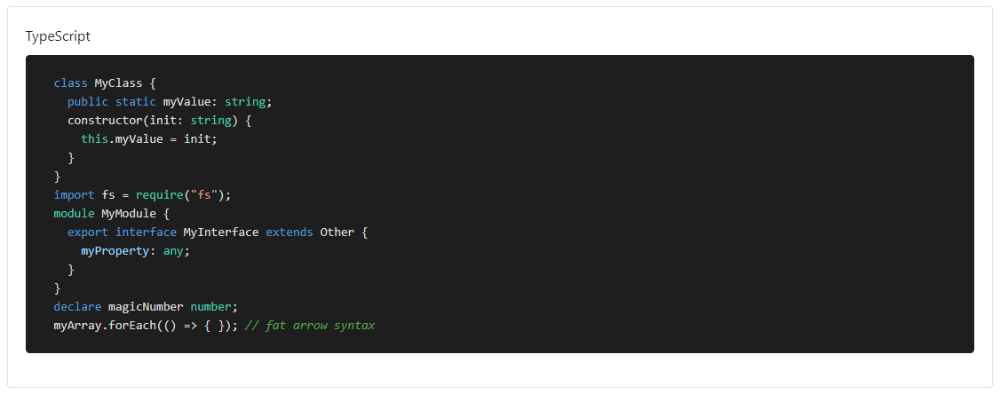

### Readme

> [](../readme.desc.md)
> [](usage.md)

### Highlighter

[](https://krsln.github.io/NgLootBox/Libraries/Highlighter)

#### Dependencies

```
 npm install highlight.js 
```

#### Properties

Name | Description
 --- | ---  
[theme] | _highlight.js theme_ classes [default: 'default']
[code] | code here or innerHTML [if code not set it will look innerHTML]
[lineNumbers] | Line Numbers [default: false]
[lang] | code language here [no need]
[options] | _highlight.js options_

### Screenshots
Highlighter VS 2015  
  
Highlighter Default  
  
