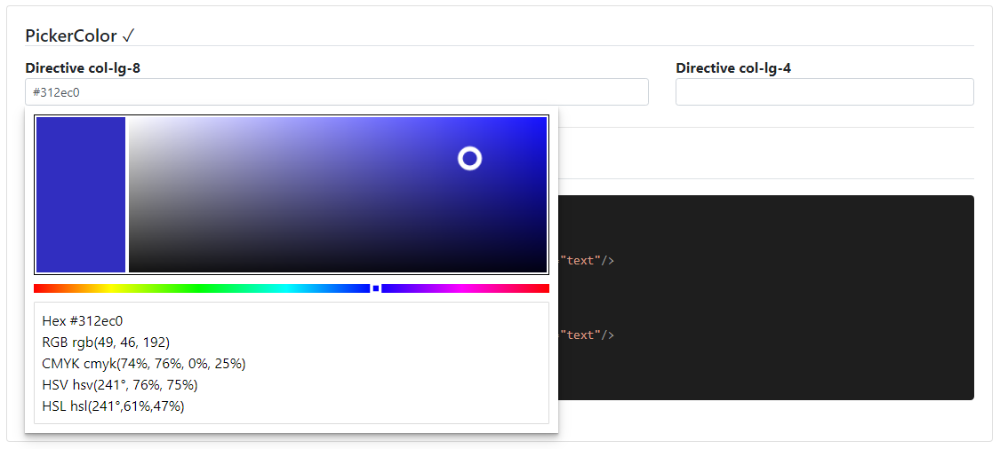

### Readme

> [](../../readme.desc.md) [](usage.md)

### PickerColor

[](https://krsln.github.io/NgLootBox/Beta/PickerColor)

#### Dependencies
import {Guid} from '@qrsln/utils/Core';

```shell
# BrowserAnimationsModule for animations
npm install --save @qrsln/utils

```

#### Properties

Name | Description
 --- | ---  
[] | -

#### Screenshots


