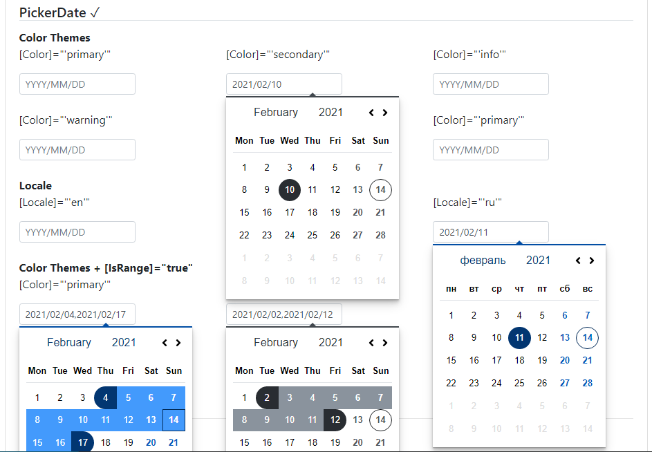

### Readme

> [](../../../readme.desc.md)
> [](usage.md)

### PickerDate

[](https://krsln.github.io/NgLootBox/Beta/PickerDate)

#### Dependencies

import {Guid} from '@qrsln/utils/Core';
import {Overlay} from '@qrsln/utils/Animations';

```shell
npm install --save @qrsln/utils
```

#### Properties

Name | Description
 --- | ---  
[Color]:string | "primary" "secondary" "success" "info" "warning" "danger" "dark"
[Locale]:string | default is 'en'
[IsRange]:boolean | default is false

#### Screenshots

  
