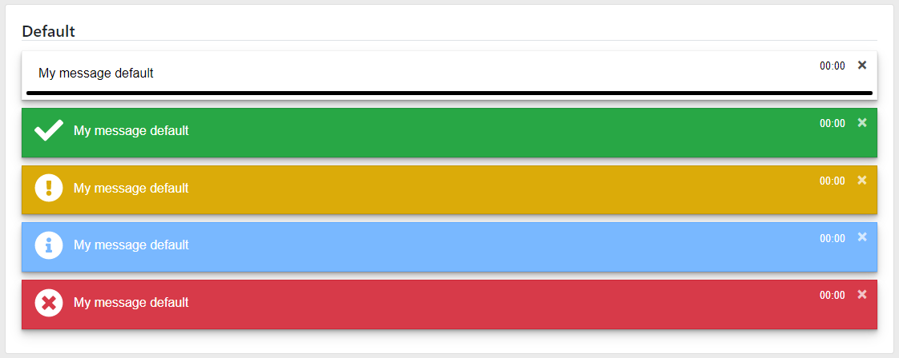
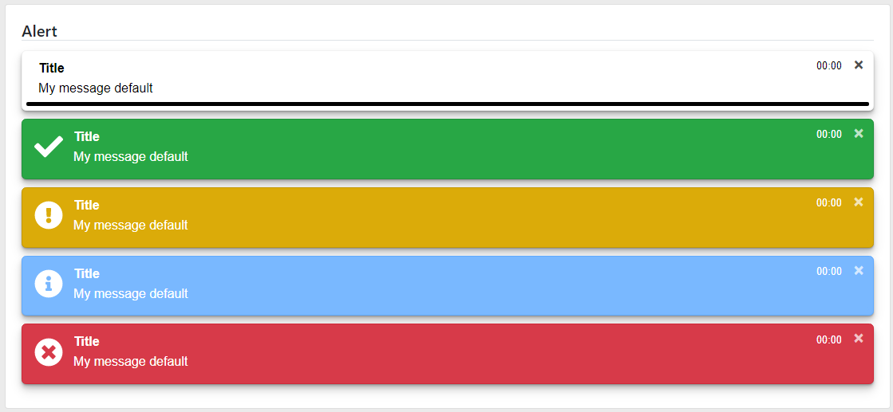
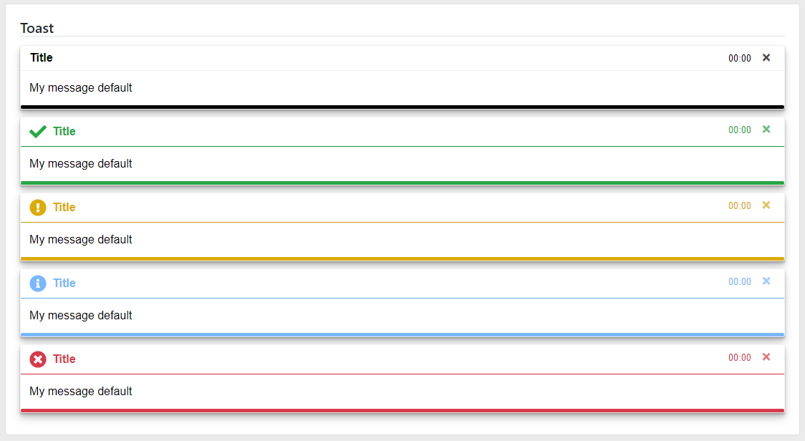

### Readme

> [](../../../readme.desc.md)
> [](usage.md)

### Notify
[](https://krsln.github.io/NgLootBox/LootBox/Notify)

#### Dependencies
```scss   
```
```
npm install bootstrap @fortawesome/fontawesome-free 
```

#### Features
Params | desc
 --- | ---  
[] | -

#### Screenshots
Notify  
  
Notify Default  
  
Notify Alert  
  
Notify Toast  
  
