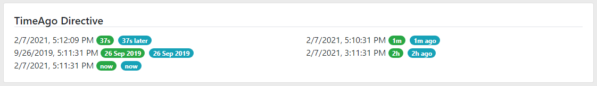
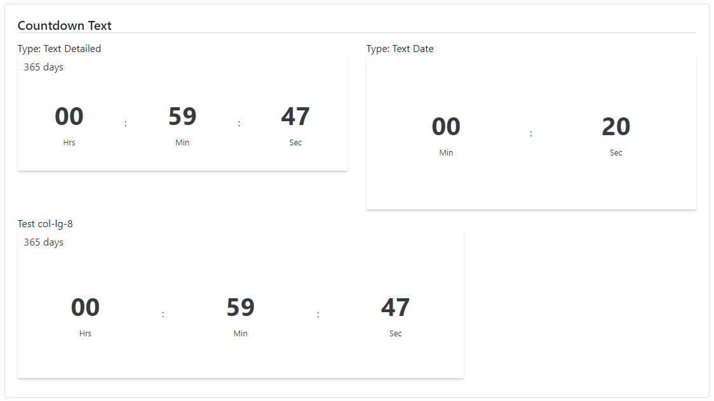
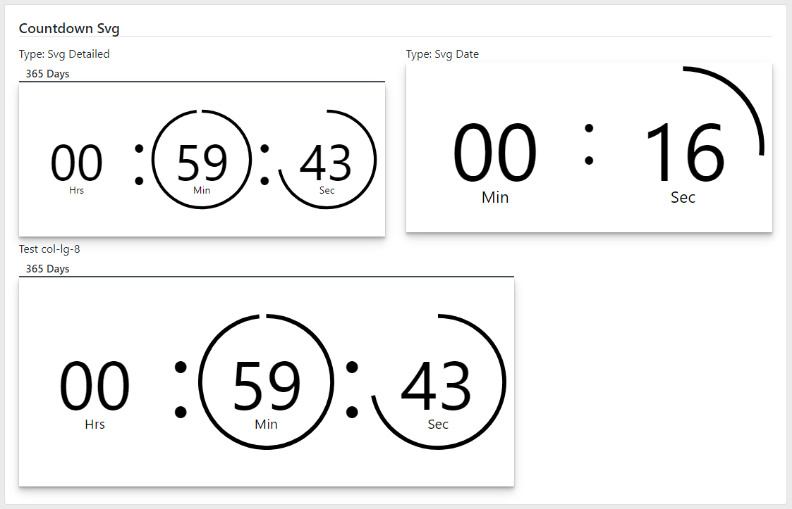
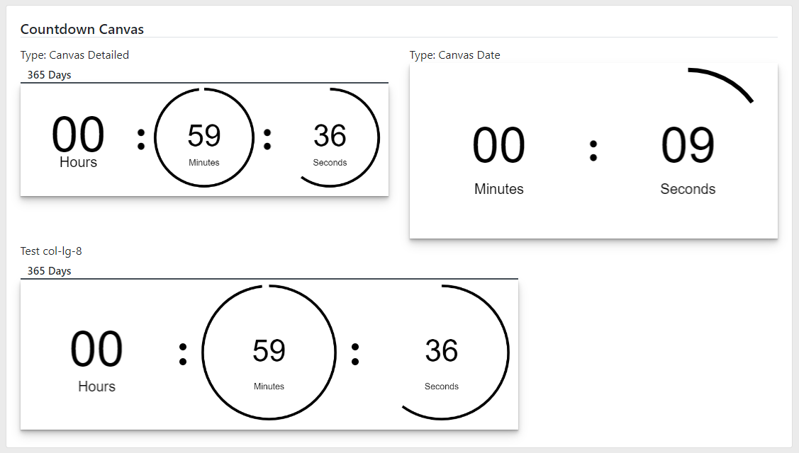

### Readme

> [](../../../readme.desc.md)
> [](usage.md)

### Timer

[](https://krsln.github.io/NgLootBox/LootBox/Timers)  

#### Dependencies
```
npm install --save 
```

###### Themes
**_Countdown_**: text | svg | canvas

#### Properties
_TimeAgo Directive_  

Name | Description
 --- | ---  
@Input() Date: Date | -
@Input() Locale: string | Not working yet
@Input() Suffix: boolean | ago/later suffixes
  
_Countdown_  

Name | Description
--- | ---  
@Input() Type: string | Text (default) Canvas Svg
@Input() Date: Date | -
@Input() Detailed: { day: number, hrs: number, min: number, sec: number }] | -

#### Screenshots
TimeAgo  
  
Countdown-Text    
  
Countdown-Svg  
  
Countdown-Canvas  
  
