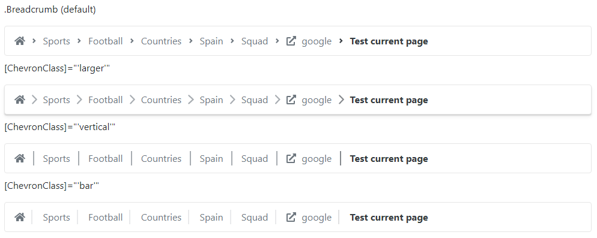
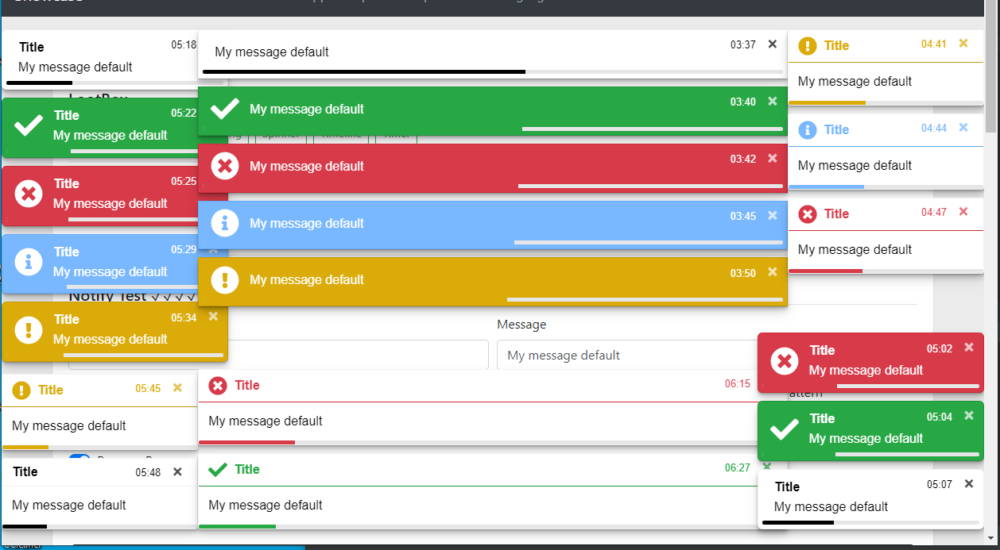
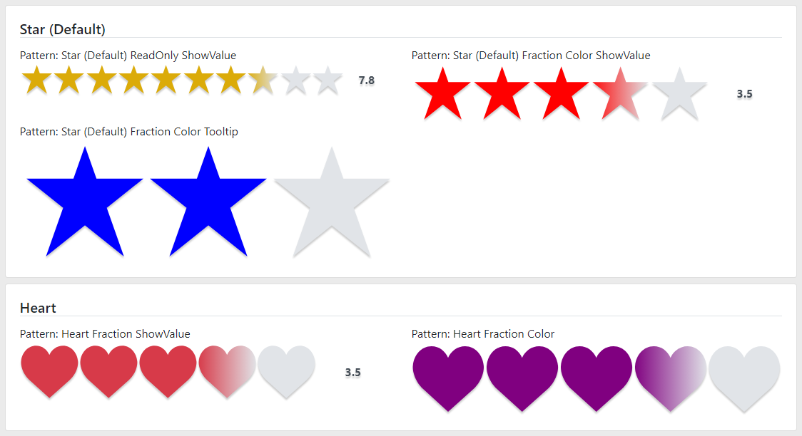
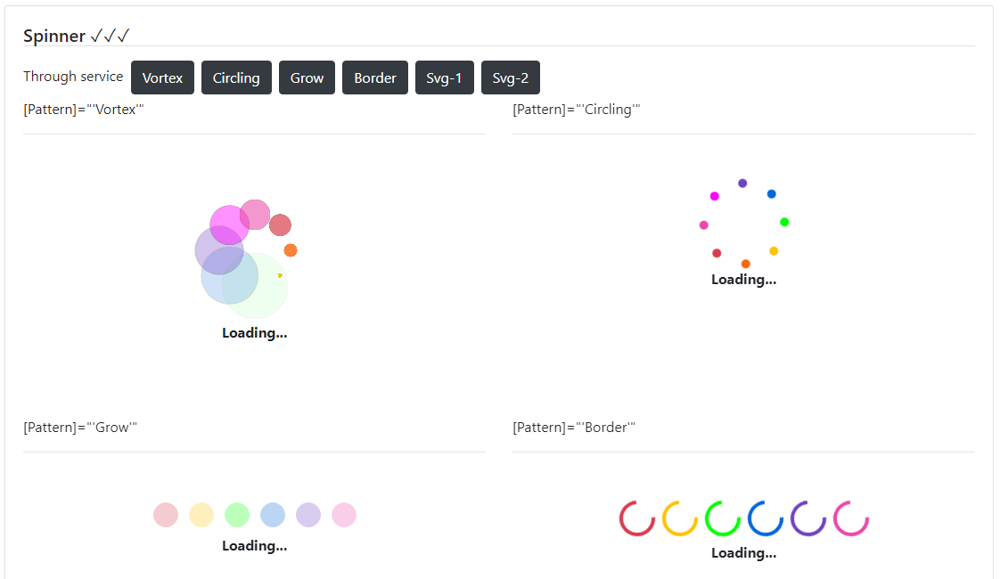

# @qrsln/loot-box

## LootBox

For Angular  

### Progress

*Perfect* | *Done* | *Almost* | *Works* | *Basic* | *Started*
  --- | --- | --- | --- | --- | ---  
 |  |  |  |  | 

## Contents

Module | Progress
   --- | ---
[Breadcrumb](#breadcrumb) | 
[Carousel](#carousel) | 
[Dialog](#dialog) | 
[Notify](#notify) | 
[Pagination](#pagination) | 
[Rating](#rating) | 
[Spinner](#spinner) | 
[Timeline](#timeline) | 
[Timer](#timer) | 

## Quick start

- Install with [npm](https://www.npmjs.com/): `npm install @qrsln/loot-box`
- Install with [yarn](https://yarnpkg.com/): `yarn add @qrsln/loot-box`

## Details

### Breadcrumb

**

### Carousel

**

### Dialog

**

### Notify

**

### Pagination

**

### Rating

**

### Spinner

**

### Timeline

**

### Timer

  

**
