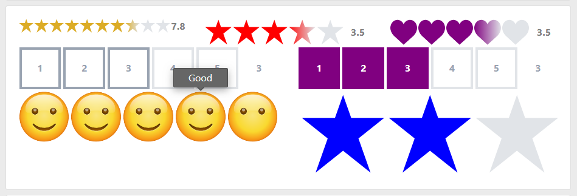
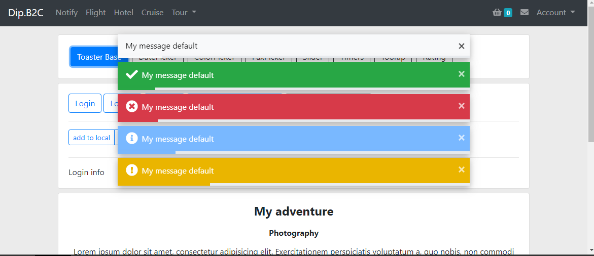

___
 Status | . | Status | .| Status | .| Status | .  | Status | .  
 --- | --- | --- | --- | --- | --- | --- | ---  | ---   | ---  
 *Perfect* | `✓✓✓✓✓` |  *Done* | `✓✓✓✓` | *Almost*  | `✓✓✓`    | *Works* | `✓✓`   |*Basic*   | `✓`  
___
 Pickers |  .  
 --- | ---  
 *ColorPicker* | `✓`  
 *DatePicker* | `✓✓✓`  
 *PaxPicker* | `✓✓`  

 Others |  .  
 --- | ---  
 *Sliders* | `✓`  
 *Mapper* | `✓✓✓`  
 *Timers* | `✓✓✓✓`  
 *Rating* | `✓✓✓✓`  
 *Notify* | `✓✓✓✓`  
 *Tooltip* | `✓✓✓✓`  
   
#### Todo
Particle   
Charts  
LightBox  

# Details
 
#### ColorPicker
Usage:  


#### DatePicker
Needs: `npm install --save moment`  
Usage: Directive (lbDatePicker)  


#### PaxPicker
Usage: Directive (lbPaxPicker)  
 
___

#### Mapper
Needs:  
`npm install @angular/google-maps`
```
index.html
<script src="https://maps.googleapis.com/maps/api/js?key=YOUR_API_KEY"></script>
```  

Usage: Directive (lbMapper)  


#### Sliders
Usage:  


#### Rating (✓✓✓✓)
Usage: Component (lb-rating)  


#### Tooltip (✓✓✓✓)
Usage: Directive (lbTooltip)  


#### Timers (✓✓✓✓)
Usage: Directive (lbTimeAgo)  
Usage: Component (lb-countdown)  
 

#### Notify (✓✓✓✓)
Needs:  
`npm install bootstrap @fortawesome/fontawesome-free`
inLayout: `<lb-notify></lb-notify>`  

Usage: Service (NotifyService)  
Usage: Component (lb-notify)  
 
 
