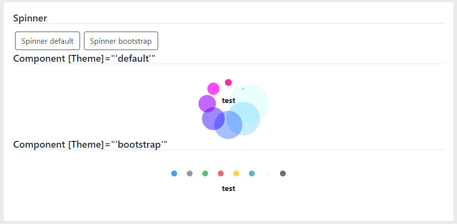
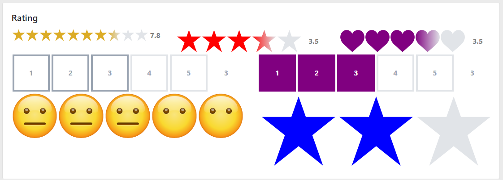
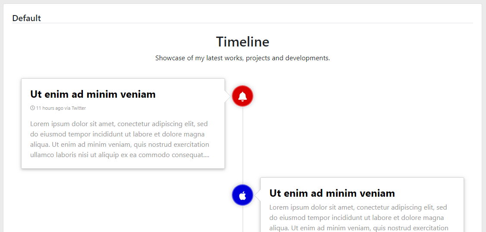

# LootBox

[Demos](https://krsln.github.io/NgLootBox)
___ 
 *Perfect* | *Done* | *Almost* | *Works* | *Basic*
  --- | --- | --- | --- | ---  
 `✓✓✓✓✓` | `✓✓✓✓` | `✓✓✓` | `✓✓`   | `✓`  
___
 Utils | Status  
 --- | ---  
 *[Guid](#guid)* | ``  
 *[WebStorage](#webstorage)* | ``  

 Libraries | Status  
 --- | ---  
 *[Piper](#piper)* | ``  
 *[Mapper](#mapper)* | `✓✓✓` 

 LootBox | Status 
 --- | ---  
 *[Breadcrumb](#breadcrumb)* | `✓✓✓`  
 *[Carousel](#carousel)* | ``  
 *[Notify](#notify)* | `✓✓✓✓`  
 *[Sliders](#sliders)* | `✓`  
 *[Spinner](#spinner)* | ``  
 *[Rating](#rating)* | `✓✓✓✓`  
 *[Tooltip](#tooltip)* | `✓✓✓✓`  
 *[Timeline](#timeline)* | `✓✓✓✓`  
 *[Timers](#timers)* | `✓✓✓✓`  

*[ColorPicker](#colorpicker)* | *[DatePicker](#datepicker)* | *[PaxPicker](#paxpicker)*
--- | ---  | ---  
`✓`  | `✓✓✓`  | `✓✓✓`  

___
#### Todo
Particle   
Charts  
LightBox  
Waves effect  
Text Distortion Effects using Blotter.js  
Animate On Scroll    https://michalsnik.github.io/aos/   
___
# Details
 
#### ColorPicker 
Usage:  


*[top↑](#lootbox)*

#### DatePicker
Needs: `npm install --save moment`  
Usage: Directive (lbDatePicker)  


[top↑](#lootbox)

#### PaxPicker
Usage: Directive (lbPaxPicker)  
 

*[top↑](#lootbox)*

___
___

#### Breadcrumb   
(✓✓✓)   
Usage: Component (lb-breadcrumb)  
 

*[top↑](#lootbox)*

#### Carousel 
Usage: Component (lb-carousel)  


*[top↑](#lootbox)*

#### Notify
(✓✓✓✓)  
Needs:  
`npm install bootstrap @fortawesome/fontawesome-free`  
inLayout: `<lb-notify></lb-notify>`  

Usage: Service (NotifyService)  
Usage: Component (lb-notify)  
 
 
*[top↑](#lootbox)* 

#### Sliders
Usage:  


*[top↑](#lootbox)*

#### Spinner
Usage: Component (lb-spinner)  
Usage: Service (SpinnerService)  


*[top↑](#lootbox)*

#### Rating
(✓✓✓✓)  
Usage: Component (lb-rating)  


*[top↑](#lootbox)*

#### Tooltip
(✓✓✓✓)  
Usage: Directive (lbTooltip)  


*[top↑](#lootbox)*

#### Timeline
(✓✓✓✓)  
Usage: Component (lb-timeline)  
 

*[top↑](#lootbox)* 

#### Timers
(✓✓✓✓)  
Usage: Directive (lbTimeAgo)  
Usage: Component (lb-countdown)  
 

*[top↑](#lootbox)*

***
***

#### Piper
        {{description|lbTruncate:size}}
        <span [innerHTML]="description|lbSanitize"></span>
 

*[top↑](#lootbox)* 

#### Mapper
Needs:  
`npm install @angular/google-maps`
```
index.html
<script src="https://maps.googleapis.com/maps/api/js?key=YOUR_API_KEY"></script>
```  

Usage: Directive (lbMapper)  


*[top↑](#lootbox)*
 
***
***

#### Guid
Usage:  
```
    let e = new Guid(); 
    e = Guid.NewGuid(); 
```
*[top↑](#lootbox)*

#### WebStorage
Usage:  
```
    constructor(private webStorage: WebStorage) {}

    webStorage.Set(StorageType.Local, 'Auth', response.Customer, 60);
    this.Customer = webStorage.Get(StorageType.Local, 'Auth');
```
*[top↑](#lootbox)*
 
