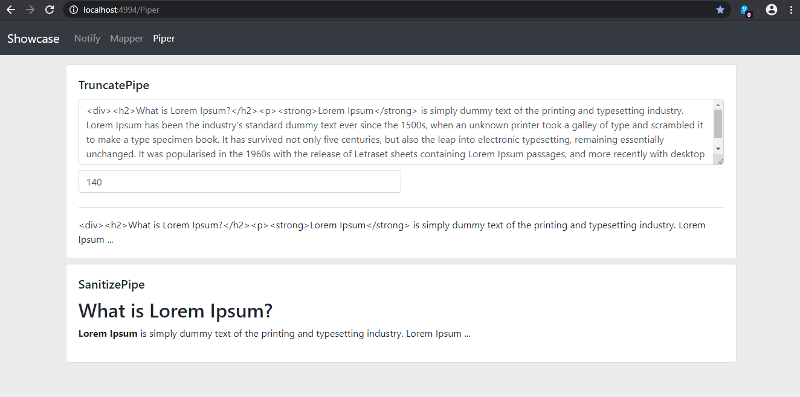

&rightarrow; &rightarrow; 
[Demo](https://krsln.github.io/NgLootBox)
&leftarrow;  &leftarrow;  
___ 
 *Perfect* | *Done* | *Almost* | *Works* | *Basic*
  --- | --- | --- | --- | ---  
 `✓✓✓✓✓` | `✓✓✓✓` | `✓✓✓` | `✓✓`   | `✓`  
___
 *[ColorPicker](#colorpicker)* | *[DatePicker](#datepicker)* | *[PaxPicker](#paxpicker)*
  --- | ---  | ---  
 `✓`  | `✓✓✓`  | `✓✓✓`  

 Libraries | Status  
 --- | ---  
 *[Piper](#piper)* | ``  
 *[Mapper](#mapper)* | `✓✓✓` 
  
 LootBox | Status 
 --- | ---  
 *[Breadcrumb](#breadcrumb)* | `✓✓✓`  
 *[Notify](#notify)* | `✓✓✓✓`  
 *[Sliders](#sliders)* | `✓`  
 *[Rating](#rating)* | `✓✓✓✓`  
 *[Tooltip](#tooltip)* | `✓✓✓✓`  
 *[Timeline](#timeline)* | `✓✓✓✓`  
 *[Timers](#timers)* | `✓✓✓✓`  
___
#### Todo
Particle   
Charts  
LightBox  
Waves effect  
Text Distortion Effects using Blotter.js  

# Details
 
#### ColorPicker 
Usage:  


#### DatePicker
Needs: `npm install --save moment`  
Usage: Directive (lbDatePicker)  


#### PaxPicker
Usage: Directive (lbPaxPicker)  
 
___

#### Sliders
Usage:  


#### Rating
(✓✓✓✓)  
Usage: Component (lb-rating)  


#### Tooltip
(✓✓✓✓)  
Usage: Directive (lbTooltip)  


#### Timers
(✓✓✓✓)  
Usage: Directive (lbTimeAgo)  
Usage: Component (lb-countdown)  
 

#### Notify
(✓✓✓✓)  
Needs:  
`npm install bootstrap @fortawesome/fontawesome-free`  
inLayout: `<lb-notify></lb-notify>`  

Usage: Service (NotifyService)  
Usage: Component (lb-notify)  
 
 
#### Breadcrumb   
(✓✓✓)  
inLayout: 
```
<lb-breadcrumb [Home]="Home" [Items]="Items" [Chevron]="'fas fa-angle-right'"></lb-breadcrumb>
```  
 
Usage: Component (lb-breadcrumb)  
 

___ 
#### Timeline
(✓✓✓✓)  
Usage: Component (lb-timeline)  
 

___ 

#### Mapper
Needs:  
`npm install @angular/google-maps`
```
index.html
<script src="https://maps.googleapis.com/maps/api/js?key=YOUR_API_KEY"></script>
```  

Usage: Directive (lbMapper)  


#### Piper
        {{description|lbTruncate:size}}
        <span [innerHTML]="description|lbSanitize"></span>
 
